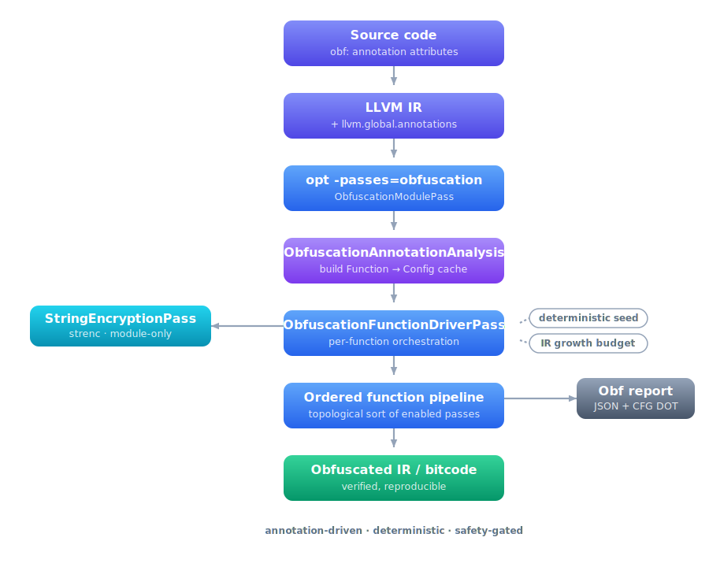
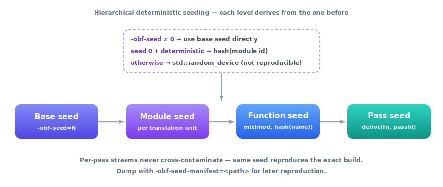

<div align="center">


# xollvm

**🛡️ Annotation-driven LLVM 22 obfuscator · new pass manager · zero LLVM source edits**


📖 [User Guide](docs/USER.md) · 🧠 [Architecture](docs/DEV.md) · ⚙️ [VM Reference](docs/VM.md) · ✅ [Tests](docs/TESTS.md)

</div>

---

An **annotation-driven** LLVM obfuscation framework for the **new pass manager** (NPM).
Configuration comes from source-level annotations (`llvm.global.annotations`) and is resolved
once per module into a cached, deterministic configuration map.

xollvm plugs into **stock LLVM with no LLVM source edits** — it is compiled in as an LLVM
*static extension* (`LLVM_EXTERNAL_PROJECTS`), so the same code ships three ways:

- a **clang/opt toolchain** with the obfuscator built in (Linux **and** Windows),
- a **loadable pass plugin** `Obfuscator.so` for `-fpass-plugin` (Linux/macOS).

> **Disclaimer / Legal:** Intended for *legitimate* software-protection use cases
> (IP protection, anti-tamper research, academic evaluation, CTFs with permission).
> **Do not use it for malware, unauthorized access, or to violate laws / terms of service.**
> You are responsible for compliance with all applicable laws.

> [!IMPORTANT]
> Obfuscation is not a security boundary. Treat it as one layer in a broader defensive strategy
> (hardening, anti-tamper, secure update, key management, …).

---

## What you get

- **Module entry pass**: `-passes=obfuscation` — module-only work (`strenc`) then an ordered
  per-function pipeline.
- **Annotation-driven config** with canonical pass IDs + aliases.
- **Deterministic seeding** (module → function → pass) with an optional seed manifest.
- **Safety rails**: instruction/block/loop-depth gating + IR-growth budgeting.
- **Diagnostics**: `-passes=obf-dump-config`, `-passes=obf-metrics`.
- **Reports**: JSON obfuscation map + per-pass CFG snapshots; HTML viewer (Python).
- **Runtime test suite** (Python) under [`utils/`](utils/).

---

## Passes (high level)

Function pipeline (order enforced by the driver via topological sort):

| Pass | ID | Category | Description |
|---|---|---|---|
| Mixed Boolean/Arithmetic | `mba` | Expression | Rewrites integer expressions as MBA equivalents. |
| Instruction substitution | `substitution` | Expression | Replaces instructions with equivalent idioms. |
| Virtual call | `vcall` | Call hardening | Virtualises direct calls via synthetic vtables. |
| Basic block split | `split` | CFG | Splits basic blocks to increase graph complexity. |
| Semantic diffusion | `sdiff` | Expression / CFG | Volatile-slot masking that resists local simplification. |
| Bogus control flow | `bcf` | CFG | Adds opaque predicates and fake edges. |
| CFG flattening | `flattening` | CFG | Replaces structured control flow with a dispatcher. |
| Anti-optimization shield | `shield` | Post-hardening | Volatile barriers and opaque identities. |
| Anti-decompiler | `adec` | Post-hardening | Indirectbr trampolines, asm junk, pointer aliasing. |
| **Code virtualisation** | **`vm`** | **Virtualisation** | **Compiles the function body into a private bytecode stream.** |

Module-only:

| Pass | ID | Description |
|---|---|---|
| String encryption | `strenc` | Encrypts string literals; enabled when any annotated function includes `strenc(...)`. |

> [!NOTE]
> `vm` conflicts with `flattening` (both restructure the CFG). Use one or the other per function.

---

## How it works

Annotations drive everything. A module analysis parses `llvm.global.annotations` once into a
cached `Function → Config` map; the module entry pass then runs module-only `strenc` and a
deterministic, budget-gated per-function pipeline.

<p align="center">
  
</p>

---

## Quick start

### Option 1 — Download a prebuilt release

Grab from [Releases](../../releases):

| File | What | OS |
|---|---|---|
| `xollvm-linux-Release.tar.zst` | `clang`/`opt` with the obfuscator built in | Linux x86_64 |
| `xollvm-windows-Release.7z` | `clang`/`opt` with the obfuscator built in | Windows x64 |
| `Obfuscator-linux-x64.so` | loadable `-fpass-plugin` | Linux x86_64 |

Backends included: `X86;AArch64;ARM;RISCV`.

### Option 2 — Build the toolchain from stock LLVM (static extension)

No fork, no patch — point LLVM's build at this repo:

```bash
git clone --depth 1 --branch release/22.x https://github.com/llvm/llvm-project
git clone https://github.com/und3ath/xollvm

cmake -S llvm-project/llvm -B build -G Ninja \
  -DCMAKE_BUILD_TYPE=Release \
  -DLLVM_ENABLE_PROJECTS="llvm;clang" \
  -DLLVM_ENABLE_RTTI=ON -DLLVM_ENABLE_EH=ON \
  -DLLVM_TARGETS_TO_BUILD="X86;AArch64;ARM;RISCV" \
  -DLLVM_EXTERNAL_PROJECTS=Obfuscator \
  -DLLVM_EXTERNAL_OBFUSCATOR_SOURCE_DIR="$PWD/xollvm" \
  -DLLVM_OBFUSCATOR_LINK_INTO_TOOLS=ON

cmake --build build --target install
```

> [!NOTE]
> Under `LINK_INTO_TOOLS` the AES stub is compiled by an **external** `clang` (the in-tree
> clang can't be used — it would form a build cycle). Make sure a `clang` is on `PATH`.

### Option 3 — Build the loadable plugin (`.so`)

```bash
# needs an installed LLVM 22 (e.g. apt llvm-22-dev)
cmake -S xollvm -B build -G Ninja -DLLVM_DIR=/usr/lib/llvm-22/lib/cmake/llvm
ninja -C build Obfuscator          # -> build/Obfuscator.so
```

---

## Annotate functions

```c
// Light: expression-level only
__attribute__((annotate("obf: mba(prob=70,maxDepth=3), substitution(loop=2)")))
int light(int x) { return x * 3 + 7; }

// Heavy: structural + post-hardening
__attribute__((annotate("obf: mba(prob=70), bcf(prob=30), flattening(minBlocks=3), shield, adec")))
int heavy(int x, int y) { return x ^ y; }

// Maximum: VM virtualisation (replaces the entire function body)
__attribute__((annotate("obf: vm(hardened=1,useAES=1,regEncrypt=1)")))
int secret(int key, int data) { return key ^ (data + 0xDEAD); }
```

C++: `[[clang::annotate("obf: mba(prob=60), bcf(prob=25)")]]`. See [`obf_annotations.h`](utils/) for the full cheat-sheet.

---

## Run it

**Prebuilt / static-extension toolchain** (obfuscator is built in):

```bash
clang -S -emit-llvm -O0 test.c -o test.ll
opt   -passes=obfuscation test.ll -S -o test.obf.ll -obf-seed=1 -obf-deterministic
clang test.obf.ll -O2 -o test.obf
```

**Loadable plugin** (`.so`):

```bash
opt -load-pass-plugin=./Obfuscator-linux-x64.so -passes=obfuscation test.ll -S -o test.obf.ll
# or with clang: clang -fpass-plugin=./Obfuscator-linux-x64.so ...
```

Diagnostics: `-passes=obf-dump-config` (resolved config), `-passes=obf-metrics` (JSONL).

---

## Reproducibility

Seeds cascade `base → module → function → pass`:

<p align="center">
  
</p>

- `-obf-seed=<N>` pins the base seed.
- `-obf-deterministic` derives the module seed from a stable hash of the module id (when seed is 0).
- `-obf-seed-manifest=seeds.json` dumps the full manifest.

---

## Documentation

| Document | Purpose |
|---|---|
| [BUILD.md](docs/BUILD.md) | Full compilation guide — static-extension toolchain (Linux/Windows), `.so` plugin, prerequisites, troubleshooting. |
| [USER.md](docs/USER.md) | Annotation grammar, pass reference, global options, reports, troubleshooting. |
| [DEV.md](docs/DEV.md) | Architecture: registration, annotation cache, pipeline ordering, reporting, adding passes. |
| [VM.md](docs/VM.md) | Code-virtualisation reference — ISA, bytecode format, hardening layers. |
| [TESTS.md](docs/TESTS.md) | Runtime test harness, categories, debug workflows. |

---

## License

Apache-2.0 WITH LLVM-exception (same as LLVM). See `LICENSE`.
