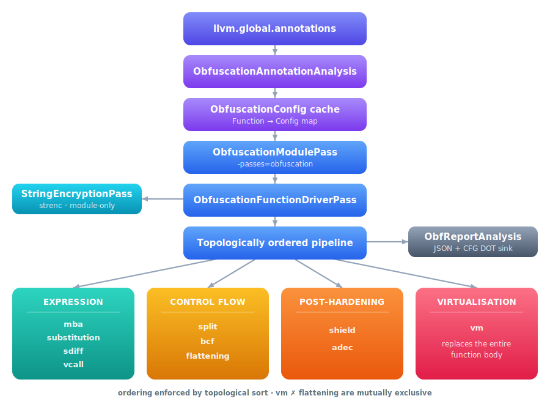

# DEVELOPER NOTES

This document covers the **architecture**, the **configuration/schema**, and practical guidance for
maintaining and extending the in-tree LLVM obfuscation framework.

## Table of contents

- [Goals and non-goals](#goals-and-non-goals)
- [High-level architecture](#high-level-architecture)
  - [Pass registration](#pass-registration)
  - [Module entry pass](#module-entry-pass)
  - [Annotation cache](#annotation-cache)
  - [Function driver](#function-driver)
  - [Pass pipeline ordering](#pass-pipeline-ordering)
  - [Deterministic seeding](#deterministic-seeding)
  - [IR growth budgeting](#ir-growth-budgeting)
- [Reporting system](#reporting-system)
  - [What gets recorded](#what-gets-recorded)
  - [JSON schema](#json-schema)
  - [CFG snapshot/diff artifacts](#cfg-snapshotdiff-artifacts)
  - [HTML generator](#html-generator)
- [Correctness hardening](#correctness-hardening)
  - [PreservedAnalyses contract](#preservedanalyses-contract)
  - [SSA repair](#ssa-repair)
  - [EH and invoke/callbr considerations](#eh-and-invokecallbr-considerations)
  - [Debug info handling](#debug-info-handling)
- [Adding a new obfuscation pass](#adding-a-new-obfuscation-pass)
- [The VM pass — implementation overview](#the-vm-pass--implementation-overview)
  - [Module-level shared engine](#module-level-shared-engine)
  - [Per-function wrapper and globals](#per-function-wrapper-and-globals)
  - [Compilation pipeline (VMImpl)](#compilation-pipeline-vmimpl)
  - [Opcode permutation](#opcode-permutation)
  - [Hardening layers](#hardening-layers)
- [Coding guidelines](#coding-guidelines)
  - [Determinism](#determinism)
  - [Performance](#performance)
  - [Diagnostics](#diagnostics)

---

## Goals and non-goals

### Goals

- **Production-grade integration** with LLVM NPM (PassBuilder / PassRegistry).
- **Reproducible transformations** via deterministic seeding.
- **Safety rails** to prevent runaway complexity and enable predictable build times.
- **Debuggability**: metrics, config dumps, report artifacts (CFG diffs, per-pass info).
- **Cross-arch awareness**: target-dependent techniques should be gated appropriately.

### Non-goals

- "Perfect" obfuscation. This is a toolkit; skilled analysts adapt.
- A stable security boundary. Do not rely on obfuscation alone.

---

## High-level architecture

<p align="center">
  
</p>

### Pass registration

Integration points in the LLVM source tree:

- `llvm/lib/Passes/PassRegistry.def` registers:
  - module pass: `obfuscation`
  - function driver: `obfuscation-fn`
  - diagnostics: `obf-dump-config`, `obf-metrics`
  - module analyses: `obf-annotations`, `obf-report`
- `llvm/lib/Passes/PassBuilder.cpp` includes `Obfuscator.h` and wires the pass names.

### Module entry pass

`ObfuscationModulePass` performs:

1. Fetch `ObfuscationAnnotationAnalysis` (builds `Function* → ObfuscationConfig` map).
2. Run module-only work (`StringEncryptionPass`) — no-ops if no function enabled `strenc`.
3. Run the function driver over all definitions.
4. Optionally write report JSON and artifacts.

### Annotation cache

`ObfuscationAnnotationAnalysis` parses `llvm.global.annotations` exactly once per module:

- Produces a `Function* → ObfuscationConfig` map.
- Computes module seed derivation data (module identifier, options).
- Optionally emits a seed manifest (`-obf-seed-manifest`).

The cache is accessed via `getObfCache(MAM, M)` / `getObfCache(F, FAM)` helpers.

**Parsing** (`ObfuscationConfig.cpp`):
- Tokenizer that respects parenthesis nesting.
- `passName(params...)` pattern.
- Per-pass parameter maps; aliased keys are normalised to canonical form.
- Multiple `obf:` annotations on the same function are merged (last-wins for params,
  additive for enablement).

### Function driver

`ObfuscationFunctionDriverPass` is responsible for:

- Per-function eligibility checks (declaration, instruction/block/loop-depth caps).
- Building `FuncPassCtx` (options, RNG, budget, report sink handle).
- Executing the pipeline in deterministic order (topological sort result).
- Emitting per-pass reports and CFG snapshots/diffs (when enabled).
- Invalidating analyses correctly when IR changes.
- Enforcing budget checks between each pass.

The driver is the single place to enforce policy:
- Early exits and skip reasons (recorded in report JSON).
- Deterministic seeding rules.
- Budget/limit enforcement.

### Pass pipeline ordering

Ordering is expressed as a partial order graph and topologically sorted into a stable sequence
(Kahn's algorithm with a deterministic tie-break). A canonical set of rules is enforced
regardless of annotation order:

| Pass | Must run after | Must run before | Conflicts with |
|---|---|---|---|
| `constenc` | — | `mba`, `substitution`, `vcall`, `split`, `sdiff`, `bcf`, `flattening`, `shield` | — |
| `mba` | — | `substitution` | — |
| `substitution` | `mba` | `vcall`, `split` | — |
| `sdiff` | `mba`, `substitution`, `vcall`, `split` | `bcf`, `flattening` | — |
| `vcall` | — | `substitution` | — |
| `split` | — | `sdiff`, `bcf` | — |
| `bcf` | `mba`, `substitution`, `split`, `sdiff`, `vcall` | `flattening` | — |
| `flattening` | `mba`, `substitution`, `split`, `sdiff`, `bcf`, `vcall` | `adec` | `vm` |
| `shield` | `mba`, `substitution`, `split`, `sdiff`, `bcf`, `vcall`, `flattening` | `adec` | — |
| `adec` | everything else | — | — |
| `vm` | `mba`, `substitution`, `vcall`, `split`, `sdiff`, `bcf` | `shield`, `adec` | `flattening` |

This avoids known bad interactions and makes the pipeline stable and reproducible.
`vm` **must not run together with `flattening`** — both restructure the entire CFG.
The pipeline driver will reject this combination.

### Deterministic seeding

Seeding is hierarchical:

- **Base seed**: from `-obf-seed`.
- **Module seed**:
  - if `-obf-seed != 0`: use the base seed directly.
  - else if `-obf-deterministic`: hash the module identifier.
  - else: `std::random_device` (non-reproducible).
- **Function seed**: `mix(moduleSeed, stableHash(F.getName()))`.
- **Pass seed**: `deriveSeed(functionSeed, passIdString)`.

This enables:
- Reproducible builds (fixed seed).
- Reproducible debugging even without an explicit seed (deterministic mode).
- Controlled per-pass randomness without cross-contamination between passes or functions.

### IR growth budgeting

`IRBudget` provides a per-function instruction growth limit:

```
Limit = clamp(insts_before × multiplier, 1, hardcap)
```

Each pass consumes from the remaining budget as the instruction count grows.
When the budget is exhausted (or the hard cap is hit), later passes in the pipeline
may be skipped. Budget state and utilization are recorded in the report JSON.

Global knobs: `-obf-ir-budget-multiplier` (default 50×), `-obf-ir-budget-max` (default 0 = no hard cap).

---

## Reporting system

The reporting system answers:

- *Which passes ran or were skipped, and why?*
- *How much did the IR grow?*
- *Where did the CFG change?*
- *Which transforms contributed to "difficulty" for a reverse engineer?*

### What gets recorded

**Per function:**

- Resolved seeds: base, module, function.
- Instruction counts before and after.
- Budget: limit, remaining, utilization percentage.
- Per-pass entries: `ran`/`skipped`, seed, `changed` flag, instruction deltas, skip reason.
- Difficulty score: cyclomatic delta, opaque predicate count, MBA node/depth stats,
  indirect branches, callbr count, indirect call count.

CFG artifacts are emitted when `-obf-report-dir` is set.

### JSON schema

Output path: `-obf-report-json=<path>` **or** `<report_dir>/obf_report.json`.

Root object:

```jsonc
{
  "schema": "llvm_obfuscator.obf_map",
  "schema_version": 1,
  "module": {
    "identifier": "string",
    "source_file": "string",      // optional
    "target_triple": "string",    // optional
    "data_layout": "string"       // optional
  },
  "functions": [ /* FunctionReport[] */ ]
}
```

Each `FunctionReport`:

```jsonc
{
  "name": "string",
  "declaration": false,
  "skipped": false,
  "skip_reason": "string",        // present when skipped=true
  "seed": {
    "base":     0,
    "module":   0,
    "function": 0
  },
  "insts": { "before": 0, "after": 0 },
  "budget": {
    "enabled": true,
    "limit": 0,
    "remaining": 0,
    "utilization": 0.0
  },
  "passes": [
    {
      "id": "mba",
      "seed": 0,
      "status": "ran",            // "ran" | "skipped"
      "changed": true,
      "skip_reason": "string",    // present when status="skipped"
      "insts_before": 0,
      "insts_after": 0,
      "delta_insts": 0,
      "budget_util_after": 0.0
    }
  ],
  "difficulty": {
    "score": 0.0,
    "cyclomatic_before": 0,
    "cyclomatic_after": 0,
    "cyclomatic_delta": 0,
    "opaque_predicates": 0,
    "opaque_per_100_insts": 0.0,
    "mba_nodes": 0,
    "mba_max_depth": 0,
    "mba_avg_depth": 0.0,
    "indirect_branches": 0,
    "callbrs": 0,
    "indirect_calls": 0
  },
  "artifacts": {                  // present when -obf-report-dir is set
    "cfg.before_dot": "cfg/fn/before.dot",
    "cfg.after_dot":  "cfg/fn/after.dot",
    "cfg.per_pass": [
      {
        "pass": "mba",
        "after_dot": "cfg/fn/per_pass/mba/after.dot",
        "diff_dot":  "cfg/fn/per_pass/mba/diff.dot"  // optional
      }
    ]
  }
}
```

> [!NOTE]
> When adding new fields, bump `schema_version` and maintain backward-compatible defaults
> for any consumers that parse the JSON.

### CFG snapshot/diff artifacts

When `-obf-report-dir` is set, DOT files are written as:

```
cfg/<function>/before.dot
cfg/<function>/after.dot
cfg/<function>/per_pass/<passId>/after.dot
cfg/<function>/per_pass/<passId>/diff.dot   (optional)
```

The diff graph colour-codes added/removed blocks and edges relative to the previous snapshot,
providing an at-a-glance view of which pass caused which CFG change.

### HTML generator

`llvm/utils/obfuscator/obf_report_html.py` consumes `obf_report.json` and emits a single
self-contained HTML file.

Available renderers (`--renderer`):

| Mode | Requirement | Output |
|---|---|---|
| `dot` (recommended) | Graphviz `dot` in PATH | Inline SVG, offline-friendly |
| `wasm` | HTTP server (MIME type requirements) | Client-side Graphviz WASM |
| `text` | None | Metadata tables only, no graphs |

---

## Correctness hardening

### PreservedAnalyses contract

The driver treats "changed" as `!PA.areAllPreserved()`.

Every obfuscation pass **must**:

- Return `PreservedAnalyses::all()` when it truly did not mutate IR.
- Return `PreservedAnalyses::none()` (or an accurate subset) when it did.

Incorrect preservation causes stale analyses to be reused, corrupts the "changed" signal in
reports, and can introduce subtle correctness bugs.

### SSA repair

Complex CFG transforms and instruction substitutions can break SSA invariants.
`ObfRepairSSA` exists to:

- Ensure PHI nodes are consistent with their predecessor edges.
- Re-insert PHI nodes when blocks are split or rewired.
- Clean up dead blocks where safe.

Best practices:
- Run repair after any heavy CFG transform.
- Keep repair deterministic (sort keys, stable iteration order).
- The pipeline driver marks `NeedsSSARepair = true` for passes that need it
  (notably `vm`).

### EH and invoke/callbr considerations

- `invoke` edges and EH funclets require extra care (WinEH, Itanium EH).
- `callbr` has special CFG semantics (asm-goto).
- Transforms should avoid touching EH pads and `callbr` blocks unless explicitly supported.

When in doubt:
- Gate transforms on `F.hasPersonalityFn()` / `hasEHFunclets()`.
- Keep `allowInvoke`-style toggles conservative (default off).
- `vm` explicitly rejects functions with EH pads, `invoke`, `callbr`, or `indirectbr`.

### Debug info handling

Options:

- `-obf-strip-debug`: remove debug metadata (explicit opt-in).
- `-obf-debug-synthetic`: mark inserted instructions as synthetic debug info where possible.

The `DebugInfoPreserver` utility should be used by passes that:
- Clone instructions.
- Move blocks around (flattening, splitting).
- Rewrite call sites.

---

## Adding a new obfuscation pass

Checklist (minimal):

1. **Implement the pass** as an NPM function pass (or module pass for module-scope work):
   - Return correct `PreservedAnalyses`.
2. **Add a config struct** if needed:
   - Extend `ObfuscationConfig.h/.cpp` with parsing and validation logic.
3. **Register the pass ID**:
   - Add the canonical ID string to `PassIds.h` and `allCanonicalPassIds()`.
   - Optionally add alias resolution in the alias lookup switch.
4. **Wire into the pipeline**:
   - Add a `PassOrderingRules` entry in `ObfuscationPipeline.cpp`.
   - Add a dispatch case in `buildPipeline()` and `getPassEntries()`.
   - Add ordering constraints relative to existing passes.
5. **Reporting hooks** (recommended):
   - Emit `obf.*` instruction names and/or metadata for difficulty scoring.
   - Per-pass CFG snapshots are automatic (the driver handles them when enabled).
6. **Tests**:
   - Add or extend runtime test cases in `llvm/utils/obfuscator/obf_runtime_tests.py`.
   - Add a report regression when feasible.

---

## The VM pass — implementation overview

The VM pass is architecturally distinct from all other passes because it **replaces the entire
function body** rather than transforming individual instructions or edges. A full dedicated
reference is in [VM.md](VM.md); this section focuses on the implementation structure.

### Module-level shared engine

To minimise binary size overhead when multiple functions are virtualised, all 51 opcode
handlers live in a single module-level function `__vm_engine()`. This function is created once
per module (by `VMEngine::getOrBuildVMEngine`) and populated on first use
(`VMEngine::populateVMEngine` / `hardenVMEngine`).

`__vm_engine` has a canonical 18-parameter signature (`VMEngine::getVMEngineFunctionType`):

```
void @__vm_engine(
    ptr  %bc,         // bytecode pointer
    i32  %bc_len,     // bytecode length
    ptr  %regs,       // [N×i32] integer register file
    ptr  %regs64,     // [N×i64] 64-bit register file
    ptr  %fregs,      // [N×double] float register file
    ptr  %pregs,      // [N×ptr] pointer register file
    ptr  %callees,    // callee address table
    i32  %salt,       // compile-time seed (volatile)
    i32  %regMask,    // nextPow2(NVR)-1
    i32  %reg64Mask,  // nextPow2(NVR64)-1
    i32  %fregMask,   // nextPow2(NFR)-1
    i32  %pregMask,   // nextPow2(NPR)-1
    ptr  %handlers,   // per-function permuted handler table
    ptr  %fty_indices,// per-function callee FunctionType index table
    ptr  %regkeys,    // per-slot i32 XOR keys (null = off)
    ptr  %reg64keys,  // per-slot i64 XOR keys (null = off)
    ptr  %fregkeys,   // per-slot f64-as-i64 XOR keys (null = off)
    i64  %callee_mask // per-slot callee XOR masks
)
```

Each virtualised function becomes a **thin wrapper** that tail-calls `__vm_engine` with its
own per-function globals (bytecode, register files, handler table).

### Per-function wrapper and globals

Three globals are emitted per virtualised function:

| Global | Type | Contents |
|---|---|---|
| `@fn.vm.bytecode` | `[L × i8]` private constant | Encrypted bytecode stream |
| `@fn.vm.ophandlers` | `[OP_COUNT × ptr]` private constant | Permuted handler-address table |
| `@fn.vm.callees` | `[C × ptr]` private constant | Callee address table |

The function body is stripped and replaced with allocas for the four register files, then a
tail call to `__vm_engine` carrying the per-function globals.

### Compilation pipeline (VMImpl)

`VMImpl::run()` executes the following phases:

1. **Eligibility check** (`isVMEligible`) — rejects EH, callbr, indirectbr, naked, block count.
2. **PHI demotion** — all PHI nodes are demoted to `alloca`/`load`/`store` pairs in a dedicated
   entry block, because the bytecode has no PHI concept.
3. **Slot assignment (Pass 1)** — `BytecodeEmitter::run()` first pass: assign integer (vreg),
   64-bit (vreg64), float (freg), and pointer (preg) register slots to every SSA value in
   declaration order. Arguments first, then entry allocas, then remaining defs.
4. **Bytecode emission (Pass 2)** — `BytecodeEmitter::run()` second pass: emit opcode bytes.
   Register-index bytes are XOR'd with `SaltConst` when `obfRegIdx=1`. Forward branch targets
   are patched after the full block walk.
5. **IR construction** (`buildBytecodeGlobal`, `buildCalleeGlobal`, `buildVMEntry`,
   `buildOpcodeHandlers`, `buildHandlerTable`, `buildDispatch`) — construct all IR.
6. **Encryption** (`buildEncryptCtorAES` or `buildEncryptCtorLCG`) — emit `.init_array`
   constructor for layer-2 bytecode encryption.
7. **Hardening** (when `hardened=1`): wrapper hardening (`hardenWrapper`, `mbaHardenWrapper`,
   `flattenWrapper`), engine hardening (`hardenVMEngine`), anti-debug (`buildAntiDebugGate`),
   integrity hash (`buildIntegrityHashCtor`), callee XOR masking (`buildCalleeXorCtor`).

### Opcode permutation

Each virtualised function gets a **unique logical↔physical opcode bijection** (`VMOpcodeMap`),
generated by Fisher-Yates shuffle seeded from the per-function RNG. The physical handler table
stored in `@fn.vm.ophandlers` is indexed by *physical* byte, so two functions cannot share the
same dispatch-table layout — defeating cross-function opcode signature matching.

### Hardening layers

Four independent hardening layers stack on top of the base interpreter:

| Layer | Knob | Mechanism |
|---|---|---|
| Register-index XOR | `obfRegIdx=1` (default) | Every register-index byte in the bytecode is XOR'd with a compile-time salt. Handlers re-XOR with a volatile salt load — correct at runtime, opaque to static analysis. |
| Bytecode encryption (LCG) | `encBytecode=1, useAES=0` | `.init_array` constructor encrypts the bytecode stream with an LCG keyed by `ptrtoint(@bytecode) XOR SEED` (ASLR-derived). Dispatch also decrypts each opcode byte. |
| Bytecode encryption (AES-CTR) | `useAES=1` (default) | Replaces LCG with AES-128-CTR. Per-function 128-bit key from the RNG hierarchy; runtime calls `__obf_aes_ctr_decrypt()` (shared with `strenc`). |
| Register-value XOR | `regEncrypt=1` | Each register file access XOR's the stored value with a per-slot key table. Adds runtime overhead but defeats memory-dump analysis. |

Additional hardening when `hardened=1`:

- MBA expressions on handler control flow.
- Opaque predicates in the dispatch loop.
- Anti-debug timing gates (RDTSC) at the dispatch level and on randomly selected handlers.
- FNV-1a bytecode integrity check in `.init_array`.
- Callee XOR masking in `.init_array`.

---

## Coding guidelines

### Determinism

- Never rely on hash-map iteration order for transformation order.
  - Sort `SmallVector` lists by stable keys (e.g., block name / index).
- Fork randomness only from the provided `Rng` / seed derivation APIs (`deriveSeed`).
- Keep report output deterministic (sort functions by name, use stable path separators).

### Performance

- Avoid quadratic behavior on block graphs.
  - Cap "candidate sites" early.
  - Honour the IR budget between passes.
- Prefer `SmallVector` / `SmallDenseMap` where the expected sizes are small.
- Do not call expensive analyses repeatedly; cache results in `FunctionObfContext`.

### Diagnostics

- Keep skip reasons explicit and actionable (size limits, budget exhaustion, unsupported IR patterns).
- Prefer structured output:
  - `obf-dump-config` for config visibility.
  - Report JSON for machine-readable debugging.
- When adding new report fields, bump `schema_version` and keep backward-compatible defaults.
- New passes should emit a `skip_reason` whenever they decide not to transform a function so
  that the report accurately reflects intent vs. actual execution.
