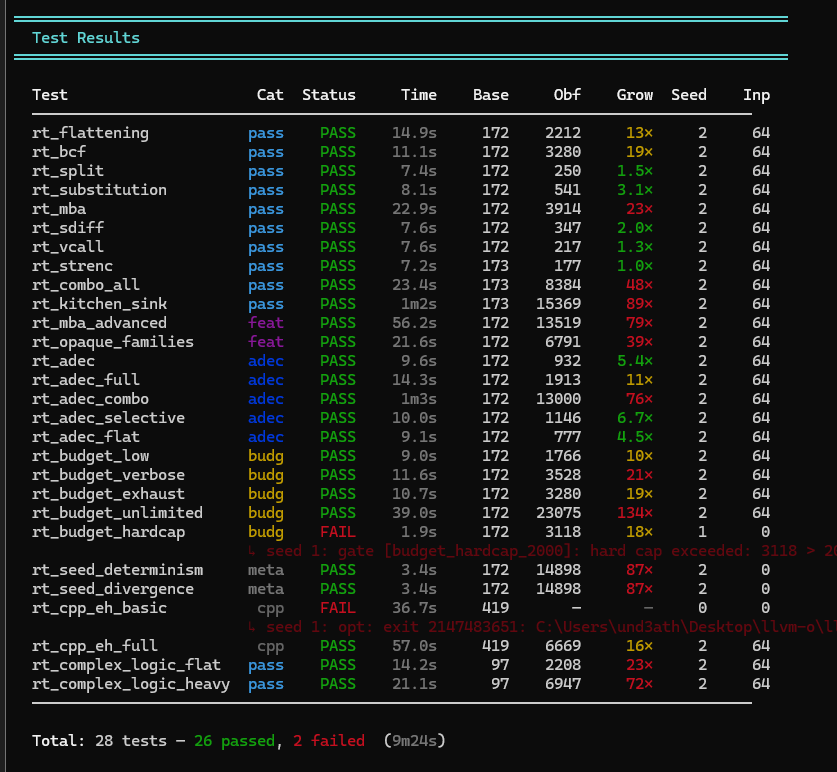
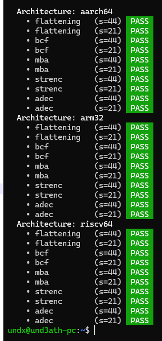
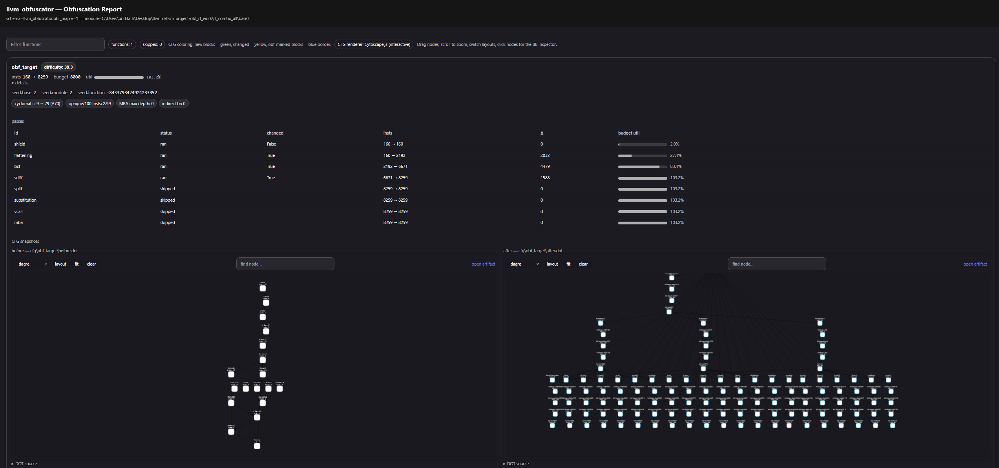
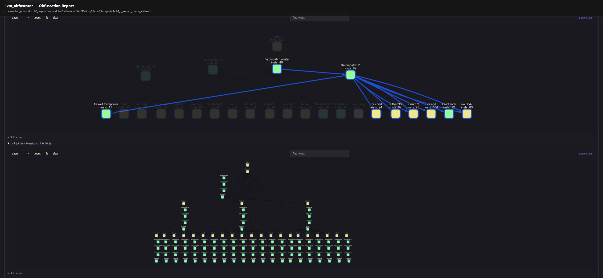

# TEST SUITE

The project ships a **runtime regression suite** to catch:

- IR correctness regressions (miscompiles)
- Pass interaction issues
- Performance pathologies (within the scope of the suite)
- Report generation regressions
- Cross-architecture codegen regressions (aarch64 / arm32 / riscv64)

The harness compiles small generated programs, runs baseline vs. obfuscated
variants, compares results, and optionally verifies that the obfuscated IR
survives a subsequent `-O2` pipeline without semantic changes.

---

## Entry points

All scripts live under `llvm/utils/obfuscator/`:

- `obf_runtime_tests.py` — main runner. Thin shim over `runner.cli.main()`.
- `obf_cross_test_wsl.py` — same runner, defaults `--targets=aarch64,arm32,riscv64`
  for the WSL bridge workflow.
- `obf_report_html.py` — standalone HTML report generator (invoked by the
  runner when `--obf-report` is enabled; can also be run directly on a JSON
  report).

The runner is now a Python package — see [Layout](#layout) below.

---

## Prerequisites

- A built LLVM tree containing `opt`, `clang`, and (for cross-arch) `llc`.
- Python 3.10+.
- Optional: Graphviz (`dot`) for offline HTML report rendering.
- Optional (cross-arch): a Linux environment with `qemu-user` plus the
  cross-gcc toolchains for the targets you want (`aarch64-linux-gnu-gcc`,
  `arm-linux-gnueabi-gcc`, `riscv64-linux-gnu-gcc`). The WSL bridge expects
  Windows-built LLVM driving WSL toolchains.

---

## Basic run

```bash
python llvm/utils/obfuscator/obf_runtime_tests.py \
  --build-dir <path-to-llvm-build> \
  --config Release \
  --seeds 1,2,3 \
  --inputs 24
```



### Useful flags

| Flag | Description |
|---|---|
| `--list` | List all available test cases and categories, then exit. No build dir required. |
| `--filter <pattern>` | Run only tests whose name contains the pattern. |
| `--category <name>` | Restrict to one category: `pass`, `feature`, `adec`, `budget`, `meta`, `cpp`, `vm`, `strenc`, `edge`, `options`, `matrix`, `exhaustive`. |
| `--seeds 1,2,3` | Run each test with multiple seeds (comma-separated). |
| `--inputs N` | Number of randomized input pairs per test (default 24). |
| `--quick` | Reduce to 8 inputs for fast iteration. |
| `--o2-gate` | After obfuscation, run the IR through `-O2` and verify semantics are preserved. |
| `--no-metrics` | Skip `obf-metrics` collection. |
| `--no-gates` | Skip IR feature-gate checks. |
| `--no-config-check` | Skip `opt -passes=obf-dump-config` validation. |
| `--targets host,...` | Cross-arch matrix (default `host`). See [Cross-architecture](#cross-architecture-testing). |
| `--extended` | Enable option sweeps, alias tests, and pairwise pass interaction matrix. |
| `--exhaustive-combos` | Generate every k-subset of passes (2 ≤ k ≤ `--combo-max-size`). |
| `--combo-max-size N` | Cap for `--exhaustive-combos` (default 3). |
| `--obf-report` | Emit obfuscation map + CFG artifacts per obfuscation run. |
| `--obf-report-out <dir>` | Output directory (default `./obf_reports`). |
| `--obf-report-no-html` | Skip HTML generation (still emits JSON + DOT). |
| `--obf-report-tool <path>` | Path to `obf_report_html.py` (auto-detected if empty). |
| `--work <dir>` | Stable work directory for inspecting artifacts. |
| `--keep` | Preserve work directory on success. |
| `--verbose` / `-v` | Print all subprocess commands. |
| `--json-report <path>` | Write a JSON summary of test results to this path. |
| `--no-color` | Disable colored terminal output. |

> [!TIP]
> When debugging a regression, pin a seed (`--seeds 1`), use `--work` with a
> stable path, and add `--keep` to preserve intermediate artifacts.

---

## Cross-architecture testing

The runner can compile each obfuscated function for additional architectures
and verify semantics under `qemu-user`. The default is host-only.

```bash
# From WSL, with cross toolchains installed:
python llvm/utils/obfuscator/obf_runtime_tests.py \
  --build-dir <path-to-llvm-build> \
  --targets host,aarch64,arm32,riscv64

# Convenience shim — defaults to all three cross targets:
python llvm/utils/obfuscator/obf_cross_test_wsl.py \
  --build-dir <path-to-llvm-build>
```

Targets currently registered (see `runner/targets.py`):

| Name | Triple | Cross-gcc | Emulator |
|---|---|---|---|
| `host` | (local) | n/a | direct exec |
| `aarch64` | `aarch64-linux-gnu` | `aarch64-linux-gnu-gcc` | `qemu-aarch64` |
| `arm32` | `arm-linux-gnueabi` | `arm-linux-gnueabi-gcc` | `qemu-arm` |
| `riscv64` | `riscv64-unknown-linux-gnu` | `riscv64-linux-gnu-gcc` | `qemu-riscv64` |

Behaviour:

- Cross-arch is **correctness-only** — gates and `obf-dump-config` checks run
  on host once; per-target runs compare base vs. obfuscated output under
  qemu-user across the same input pairs.
- Tests in categories `strenc`, `cpp`, and `meta` are **skipped** on
  cross-arch (their semantics — exit code, EH, seed determinism — don't fit
  the differential-exec model).
- Targets with missing `cross-gcc` or `qemu-*` on PATH are **skipped, not
  failed**. The startup banner shows which targets are available.

Per-target results appear in the JSON report under `tests[].cross`.



---

## Report generation

`--obf-report` enables per-obfuscation-run JSON + DOT artifacts. HTML
rendering is automatic when Graphviz is available; disable with
`--obf-report-no-html`.

```bash
python llvm/utils/obfuscator/obf_runtime_tests.py \
  --build-dir <path-to-llvm-build> \
  --seeds 1 --inputs 16 \
  --obf-report --obf-report-out ./obf_reports
```

Per-test layout:

```
obf_reports/
  <test-name>/
    seed_<n>/
      obf_report.json
      cfg/<function>/before.dot
      cfg/<function>/after.dot
      cfg/<function>/per_pass/<pass>/after.dot
      cfg/<function>/per_pass/<pass>/diff.dot
      obf_report.html
  index.html
```




---

## Test categories

| Category | What it tests |
|---|---|
| `pass` | Individual pass correctness + combo + kitchen-sink + complex-logic. |
| `feature` | Advanced MBA, opaque-predicate families. |
| `adec` | Anti-decompiler patterns. |
| `budget` | IR instruction budget system (caps, exhaustion, multipliers). |
| `meta` | Seed determinism / divergence. |
| `cpp` | C++ + EH programs (invoke/landingpad eligibility). |
| `vm` | Virtualisation pass v7 — structural, hardening, regenc, shared engine. |
| `strenc` | AES-128-CTR string encryption + `aes_stub` sub-pass variants. |
| `edge` | Edge-case IR shapes — int widths, switches, indirectbr, recursion, struct-by-value, vectors, nested loops, tail calls. |
| `options` | Per-option sweeps (gated by `--extended`). |
| `matrix` | Pairwise pass-interaction stress matrix (`--extended`). |
| `exhaustive` | Every k-subset of passes (`--exhaustive-combos`). |

---

## Skip-channel assertions

Passes that bail out for IR-level reasons (eligibility check failed,
function caps tripped, IR budget exhausted) publish a structured skip
reason via `recordObfPassSkip(FOC, "<passId>", "<reason>")`. The driver
flushes these into the JSON report's `passes[].skip_reason` field and,
when `-obf-no-skips` is enabled, escalates any skip to a fatal compile
error.

### Per-test field

`TestCase.expect_no_skips` accepts three values:

| Value | Behavior |
|---|---|
| `None` (default) | Inherit from runner CLI — see `--strict-skips` below. |
| `True` | Force strict: any skip aborts. Cheap CLI fatal when `allowed_skip_reasons` is empty; JSON post-check otherwise. |
| `False` | Force lenient: skips tolerated regardless of CLI mode. Use for tests that legitimately exercise eligibility bail-outs (EH programs, indirectbr IR). |

`TestCase.allowed_skip_reasons` (`set[str]`) — when non-empty, the strict
CLI gate is replaced with a JSON post-check that allows only those reason
tokens (e.g. `{"budget_exhausted"}` for budget-exhaustion tests).

### Suite-wide flag

`--strict-skips` (off by default) flips the inherited default so that any
test with two or more passes auto-asserts no silent skips. Tests with an
explicit `expect_no_skips=False` or a populated `allowed_skip_reasons`
keep their per-case behavior.

Recommended for CI nightly runs:

```bash
python llvm/utils/obfuscator/obf_runtime_tests.py \
  --build-dir <build> --extended --exhaustive-combos --combo-max-size 3 \
  --strict-skips
```

Common reason tokens currently emitted:

- `eh_unsupported`, `callbr`, `indirectbr already`, `naked`,
  `too few blocks`, `too many blocks` — `vm` eligibility
- `ineligible` — generic eligibility fallback (`bcf`, `split`, `adec`,
  `flattening`)
- `flatten_failed` — `flattening` ran but inner CFG rewrite returned false
- `invalid_loop_count`, `invalid_num_param` — pass-config validation
- `budget_exhausted` — driver IR budget gate
- `cap_max_function_insts`, `cap_max_function_blocks`,
  `cap_max_loop_depth` — function-level caps

Reference test: [meta_no_skips_full_pipeline](llvm/utils/obfuscator/cases/extended.py)
runs the full pipeline on a benign arithmetic function and asserts that
no pass silently degrades.

---

## Layout

The runner is a small Python package tree:

```
llvm/utils/obfuscator/
├── obf_runtime_tests.py        # shim → runner.cli.main()
├── obf_cross_test_wsl.py       # shim with --targets=aarch64,arm32,riscv64
├── obf_report_html.py          # HTML report generator (standalone tool)
│
├── runner/                     # framework — no test data
│   ├── cli.py                  # argparse + main()
│   ├── config.py               # Tools dataclass, detect_tools()
│   ├── pipeline.py             # compile, obfuscate, dump-config, metrics, O2
│   ├── targets.py              # Target registry (host, aarch64, arm32, riscv64)
│   ├── cross.py                # build_for_target + exec_target (qemu-user)
│   ├── util.py                 # run_cmd, IR counters, exec/compare
│   ├── fmt.py                  # color/badge helpers
│   └── reporter/               # console, JSON, HTML reporters
│
├── gates/                      # decorator-registered IR predicates
│   ├── __init__.py             # registry + run_gate dispatcher
│   ├── _ir.py                  # extract_fn_body helper
│   ├── mba.py adec.py budget.py seed.py strenc.py aes_stub.py
│   └── vm.py vm_hardened.py vm_regenc.py vm_engine.py
│
├── programs/                   # *.c.tmpl / *.cpp.tmpl test corpora
│   ├── __init__.py             # render(name, **kwargs) lookup
│   ├── base/                   # host_arith, complex_logic
│   ├── eh/                     # throw_catch.cpp.tmpl
│   ├── vm/                     # memory, gep_chain, call, casts, icmp, ...
│   ├── strenc/                 # basic, multi, minlen, xor_fallback
│   ├── aes_stub/               # obfuscated, passes
│   └── edge/                   # int_widths, switch_*, indirectbr_cgoto, ...
│
└── cases/                      # per-category TestCase factories
    ├── __init__.py             # make_tests() dispatcher
    ├── _common.py              # TestCase, ANN dicts, render_*() wrappers
    ├── _runner.py              # TestResult, run_test, cross-arch loop
    ├── passes.py features.py adec.py budget.py seed.py eh.py
    ├── vm.py strenc.py edge.py
    └── extended.py exhaustive.py
```

---

## Adding things

### A new test case

Each `cases/<category>.py` exposes `register(reg, **opts)`. Append to `reg`:

```python
# cases/edge.py (example pattern)
def register(reg, **_opts):
    reg.add(
        name="rt_edge_my_test",
        passes=["mba", "bcf"],          # annotation generated from this
        # ann_override="mba(prob=50)",  # optional explicit annotation
        # gates=["my_gate"],            # optional IR predicates to verify
        # src_override=programs.render("edge.my_program", annotation=ann),
        category="edge",
    )
```

### A new program

Drop a `.c.tmpl` (or `.cpp.tmpl`) under `programs/<subdir>/`. The template
uses str.format syntax — escape literal braces as `{{` / `}}`:

```c
#include <stdint.h>
#include <stdio.h>
#include <stdlib.h>

__attribute__((noinline, annotate("{annotation}")))
uint32_t obf_target(uint32_t x, uint32_t y) {{
    return (x ^ y) + 1u;
}}

int main(int argc, char** argv) {{
    uint32_t x = (argc > 1) ? (uint32_t)strtoul(argv[1], 0, 0) : 0u;
    uint32_t y = (argc > 2) ? (uint32_t)strtoul(argv[2], 0, 0) : 0u;
    uint32_t r = obf_target(x, y);
    printf("R=%u\n", r);
    return (int)(r & 0xFFu);
}}
```

Lookup by dotted name: `programs.render("edge.my_program", annotation=ann)`.
Programs must keep the `obf_target(uint32_t, uint32_t) -> uint32_t` shape
so the differential exec harness works unchanged.

### A new gate

Pick the right `gates/<family>.py` (or add one), then decorate:

```python
# gates/mba.py
from . import register

@register("my_pattern")            # needs="ir" by default
def my_pattern(ir: str):
    if "expected_token" not in ir:
        return "expected_token not found"
    return None
```

Other `needs` kinds: `"ir_pair"` (seed determinism/divergence),
`"stderr"` (verbose-output checks), `"ir_and_base"` (size-delta checks).
Parametric gates (e.g. `budget_clamped_<N>`) are dispatched from
`gates/__init__.py`'s `run_gate`.

Reference the gate by name in `TestCase.gates`.

---

## Debug workflows

### 1) Bisect pass interactions

1. Re-run the failing test with a fixed seed and a stable work dir:
   ```bash
   python obf_runtime_tests.py --build-dir build --seeds 1 \
     --work /tmp/obf_work --filter "failing_test_name" --keep
   ```
2. Turn off all passes except one. Most test cases group passes in their
   annotation string — edit the relevant `cases/*.py` entry locally.
3. Add passes back incrementally until the failure reproduces.

### 2) Use the report to find the introducing pass

Enable `--obf-report` on the failing test and open the HTML viewer:

- Navigate to the failing function.
- Look at `passes[]` in the JSON or the HTML pass table:
  - Which pass first shows a large CFG delta?
  - Which pass triggers a budget spike?
  - Which pass has a skip reason?
- Examine the `diff.dot` for the introducing pass.

### 3) O2 gate failures

If `--o2-gate` fails:

- Check whether a pass relies on UB or assumes no further optimization will
  occur.
- Confirm that inserted `volatile` loads/stores and opaque predicates are
  optimization-resistant under the specific LLVM optimizer passes.
- Inspect the diff DOT: often a critical edge or block was removed/merged
  by `simplifycfg` or `instcombine`.
- For `vm`: the wrapper must use `volatile` on the IP and salt allocas;
  verify in the emitted IR.

### 4) VM-specific debugging

```bash
# Eligibility decisions and bytecode sizes
opt -passes=obfuscation -S test.ll -o /dev/null \
  -obf-seed=1 -obf-verbose 2>&1 | grep '\[vm\]\|\[obf\]'

# Confirm the vm pass ran
grep -c 'vm.bytecode\|__vm_engine' test.obf.ll

# Verify the obfuscated IR is valid
opt -passes=verify test.obf.ll -o /dev/null
```

### 5) Cross-arch failures

`--targets` failures usually fall into one of:

- **Missing toolchain**: target shows `SKIP` in the banner — install the
  cross-gcc and qemu-user packages for the architecture.
- **Codegen-level mismatch**: base and obfuscated diverge under qemu while
  passing on host. Inspect with:
  ```bash
  llc -mtriple=aarch64-linux-gnu -S obf.ll -o obf.s
  aarch64-linux-gnu-gcc -static obf.s -o obf
  qemu-aarch64 ./obf <x> <y>
  ```
- **RISC-V attribute mismatch**: handled automatically (the runner strips
  `.attribute` directives before invoking the GNU assembler).
