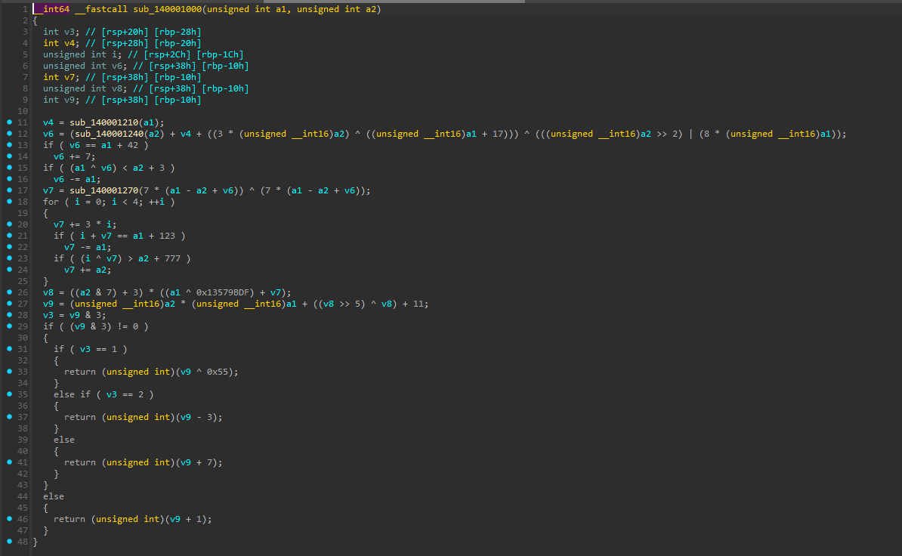
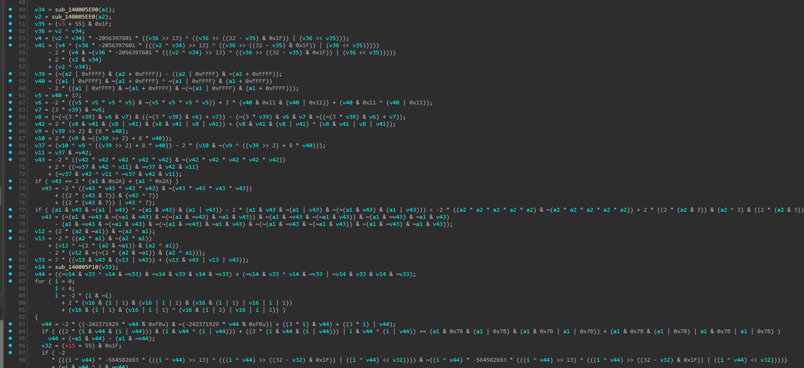
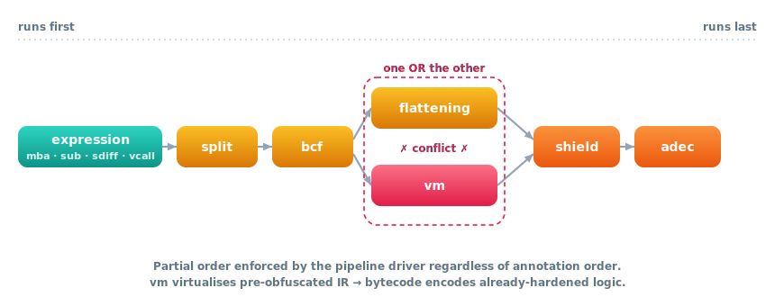

# USER GUIDE

This guide explains how to **enable and tune** the obfuscation pipeline, how to generate
**JSON/HTML reports**, and how to troubleshoot correctness and performance issues.

## Table of contents

- [Quick mental model](#quick-mental-model)
- [Configuration via annotations](#configuration-via-annotations)
  - [Grammar](#grammar)
  - [Pass IDs and aliases](#pass-ids-and-aliases)
  - [Parameter parsing rules](#parameter-parsing-rules)
  - [Multiple annotations and merging](#multiple-annotations-and-merging)
- [Running the obfuscator](#running-the-obfuscator)
  - [Using opt](#using-opt)
  - [Using clang](#using-clang)
  - [Diagnostic passes](#diagnostic-passes)
- [Global command-line options](#global-command-line-options)
- [Obfuscation reports](#obfuscation-reports)
  - [Enable report generation](#enable-report-generation)
  - [Generate the HTML viewer](#generate-the-html-viewer)
  - [Troubleshooting report rendering](#troubleshooting-report-rendering)
- [Pass reference](#pass-reference)
  - [mba](#mba)
  - [substitution](#substitution)
  - [vcall](#vcall)
  - [split](#split)
  - [sdiff](#sdiff)
  - [bcf](#bcf)
  - [flattening](#flattening)
  - [shield](#shield)
  - [adec](#adec)
  - [vm](#vm)
  - [strenc](#strenc)
- [Choosing an obfuscation strategy](#choosing-an-obfuscation-strategy)
- [Troubleshooting](#troubleshooting)

---

## Quick mental model

1. **You annotate** functions with `"obf: ..."` specs.
2. A module analysis parses all annotations into a cached map: `Function → ObfuscationConfig`.
3. The module entry pass `obfuscation` runs:
   - module-only work (`strenc`) if enabled anywhere in the module
   - a function driver that executes the **topologically sorted** function pipeline
4. Optional:
   - verification (`-obf-verify`)
   - metrics and reports

---

## Configuration via annotations

### Grammar

In C/C++ the common pattern is:

```c
__attribute__((annotate("obf: <spec>")))
```

Where `<spec>` is a comma-separated list of pass specifications:

```
<spec>     := <passSpec> ( "," <passSpec> )*
<passSpec> := <passName> [ "(" <params> ")" ]
<params>   := <kv> ( "," <kv> )*
<kv>       := <key> "=" <value>
```

Example:

```c
__attribute__((annotate("obf: mba(prob=70,maxDepth=3), bcf(prob=40,loop=1), flattening(minBlocks=3,maxBlocks=120)")))
```

In C++ you can also use the attribute syntax:

```cpp
[[clang::annotate("obf: mba(prob=60), bcf(prob=25)")]]
```

### Pass IDs and aliases

| Category | Canonical ID | Accepted aliases |
|---|---|---|
| Expression / data-flow | `mba` | — |
| Expression / data-flow | `substitution` | `sub` |
| Expression / data-flow | `sdiff` | — |
| Call hardening | `vcall` | — |
| CFG | `split` | — |
| CFG | `bcf` | — |
| CFG | `flattening` | `fla` |
| Post-hardening | `shield` | `antiopt`, `anti-opt` |
| Post-hardening | `adec` | `anti-decompiler`, `antidecompiler` |
| Virtualisation | `vm` | `virtualize`, `virt` |
| Module-only | `strenc` | — |

Aliases are case-insensitive. Canonical IDs in reports and manifests are always the canonical form.

> [!NOTE]
> The pipeline driver enforces a stable ordering between passes via topological sort, regardless
> of annotation order. See [Choosing an obfuscation strategy](#choosing-an-obfuscation-strategy)
> for the effective execution order.

> [!NOTE]
> An internal `aes_stub` module pass also exists. It is **not user-callable** via annotations —
> it is auto-linked when `strenc` or `vm` (with `useAES=1`) is enabled, and embeds the shared
> `__obf_aes_ctr_decrypt` runtime into the module. You do not need to mention it in `obf:` specs.

### Parameter parsing rules

- Keys are `[A-Za-z0-9_]` (no dashes).
- Values can be:
  - unquoted: `maxSites=200`
  - quoted: `tag="hello world"`
- Whitespace around tokens is ignored.
- For most boolean knobs, use `0` / `1`. Some passes also accept `true/false/yes/no/on/off`.

### Multiple annotations and merging

If the same function carries multiple `obf:` annotations, configs are merged:

- Pass enablement is **additive**.
- Parameters are **overridden** by later annotations (last wins).
- Pass ordering is resolved after merging, so stacking annotations is safe.

```c
// Enable mba from one annotation, bcf from another — both will run.
__attribute__((annotate("obf: mba(prob=60)")))
__attribute__((annotate("obf: bcf(prob=30)")))
int fn(int x) { return x; }
```

---

## Running the obfuscator

### Using opt

```bash
# 1) Compile to IR
clang -S -emit-llvm -O0 -g test.c -o test.ll

# 2) Run the module entry pass
opt -passes=obfuscation -S test.ll -o test.obf.ll \
  -obf-seed=1 -obf-deterministic -obf-verify

# 3) Compile obfuscated IR to native
clang test.obf.ll -O2 -o test.obf
```

### Using clang

Because this is **in-tree**, you can pass the pipeline directly to clang via `-mllvm`:

```bash
clang test.c -O2 \
  -mllvm -passes=obfuscation \
  -mllvm -obf-seed=1 \
  -mllvm -obf-deterministic \
  -o test.obf
```

If your toolchain does not forward `-passes` reliably through `-mllvm`, use the `opt` flow instead.

### Diagnostic passes

These are useful when debugging config resolution or measuring impact:

```bash
# Print resolved per-function config and computed seeds
opt -passes=obf-dump-config -S test.ll -o /dev/null -obf-verbose -obf-seed=1

# Emit JSONL metrics per function (instruction counts, cyclomatic complexity, etc.)
opt -passes=obf-metrics -S test.ll -o /dev/null > metrics.jsonl
```

---

## Global command-line options

### Core

| Option | Default | Meaning |
|---|---:|---|
| `-obf-seed=<N>` | 0 | Base seed. Non-zero makes all runs reproducible. |
| `-obf-deterministic` | off | When seed is 0: derive module seed from module identifier hash (otherwise uses `random_device`). |
| `-obf-verify` | off | Run IR verification before/after each obfuscation stage. |
| `-obf-verbose` | off | Print extra info (parsing, skips, budgets, pipeline order, etc.). |
| `-obf-max-function-insts=<N>` | 0 (off) | Skip functions larger than N instructions. |
| `-obf-max-function-blocks=<N>` | 0 (off) | Skip functions larger than N basic blocks. |
| `-obf-max-loop-depth=<N>` | 0 (off) | Skip functions whose loop nesting depth exceeds N. |

### IR budget

| Option | Default | Meaning |
|---|---:|---|
| `-obf-ir-budget-multiplier=<N>` | 50 | Budget limit = `insts_before × N` (clamped by `-obf-ir-budget-max`). 0 = unlimited. |
| `-obf-ir-budget-max=<N>` | 0 (off) | Absolute IR instruction ceiling per function. 0 = no hard cap. |

> [!NOTE]
> Budget knobs are global — they cannot currently be expressed as per-function annotation tokens.
> Use the command-line options above to tune budgets globally.

### Pipeline ordering overrides

| Option | Default | Meaning |
|---|---:|---|
| `-obf-pipeline-ordering=<csv>` | "" | Explicit comma-separated pipeline order (e.g. `mba,split,bcf,flattening`). Listed passes run first in this order; remaining enabled passes are appended in topological order. Unknown names are fatal. |
| `-obf-pipeline-ordering-ann` | off | Use the per-function annotation order verbatim instead of topological sort. Ignored when `-obf-pipeline-ordering` is set. |

The default is topological sort with conflict enforcement (e.g. `vm` + `flattening` rejected).
Both override modes still run conflict checks.

### Seed manifest

| Option | Default | Meaning |
|---|---:|---|
| `-obf-seed-manifest=<path>` | "" | Write a JSON seed manifest (base/module/function/pass seeds) to stderr if set to `-`, else to the given path. |
| `-obf-seed-manifest-md` | off | Also emit per-pass seed manifest into LLVM IR metadata (`obf.seed.manifest.<passId>`). |

### Debug info

| Option | Default | Meaning |
|---|---:|---|
| `-obf-strip-debug` | off | Strip debug metadata from obfuscated functions only. |
| `-obf-debug-synthetic` | on | Assign synthetic line-0 debug locations to obfuscation-inserted instructions so source steppers do not jump erratically. |

### Shield auto-enable

| Option | Default | Meaning |
|---|---:|---|
| `-obf-shield-auto` | off | Auto-enable `shield` with default knobs for any function that has any obfuscation pass annotated but no explicit `shield(...)` token. Explicit `shield(...)` annotations are always honored regardless of this flag. |

### Reports

| Option | Default | Meaning |
|---|---:|---|
| `-obf-report-dir=<dir>` | "" | Emit report artifacts (CFG DOT files, JSON) into this directory. |
| `-obf-report-json=<path>` | "" | Write report JSON to this path (`-` = stdout). |

### Anti-decompiler (`adec`) tuning

| Option | Default | Meaning |
|---|---:|---|
| `-adec-gadgets-file=<paths>` | "" | Comma-separated JSON gadget files merged into the global pool. |
| `-adec-disable-builtin-gadgets` | off | Drop compile-time built-in gadget tables; use only user files / annotations. |
| `-adec-clobbers-x86=<csv>` | (built-in) | Override default inline-asm clobber list for x86_64. Comma-separated short register names. |
| `-adec-clobbers-aarch64=<csv>` | (empty) | Override default inline-asm clobber list for aarch64. |
| `-adec-techniques=<csv>` | "" (all) | Whitelist of technique names (`asmGadgets,indirectBr,deadDecoy,stackPollution,callTrampoline,aliasConfusion,fakeLoop,rdtscStretch,constLaunder`). |
| `-adec-categories=<csv>` | "" (all) | Gadget category filter (`anti-disasm,anti-trace,desync,...`). |
| `-adec-budget-split=<key:pct,...>` | (defaults) | Per-technique budget percent split. Keys: `asm,ibr,decoy,call,alias,loop,rdtsc,clndr`. |
| `-adec-prefix=<name>` | `adec` | IR-name prefix for adec artifacts. Override with per-build random value to defeat signature scans against canonical `adec.*` names. |
| `-adec-randomize-consts` | off | Replace hard-coded decoy payload constants with RNG values. |

> [!NOTE]
> Per-function annotation parameters (`adec(gadgets="path",techniques="...",categories="...",asmInline="A;B;C")`)
> override the CLI flags above when both are present.

---

## Obfuscation reports

The report system is designed for **debugging and troubleshooting**: it helps you understand
*what changed*, *where it changed*, and *which pass caused it*.

### Enable report generation

Run `opt` with a report directory and a fixed seed:

```bash
opt -passes=obfuscation -S test.ll -o test.obf.ll \
  -obf-seed=1 -obf-deterministic \
  -obf-report-dir=obf_report
```

This produces:

- `obf_report/obf_report.json` — machine-readable obfuscation map
- `obf_report/cfg/<fn>/before.dot` — CFG before any pass
- `obf_report/cfg/<fn>/after.dot` — CFG after all passes
- `obf_report/cfg/<fn>/per_pass/<passId>/after.dot` — CFG after each pass
- `obf_report/cfg/<fn>/per_pass/<passId>/diff.dot` — optional diff overlay

### Generate the HTML viewer

```bash
python llvm/utils/obfuscator/obf_report_html.py \
  --json obf_report/obf_report.json \
  --out  obf_report/obf_report.html \
  --renderer dot
```

Open `obf_report.html` in your browser. The viewer provides per-function views with:

- pass-by-pass instruction count deltas
- CFG before/after
- per-pass diff overlays
- difficulty score (cyclomatic complexity, opaque predicate count, MBA depth, etc.)

### Troubleshooting report rendering

- **Prefer `--renderer dot`** and install **Graphviz** so `dot` / `dot.exe` is in `PATH`.
  This renders graphs offline as inline SVG without any CDN or WASM dependencies.
- **`--renderer wasm`** requires the HTML to be served via HTTP:

```bash
python -m http.server 8000 --directory obf_report
# Then open http://localhost:8000/obf_report.html
```

- **`--renderer text`** produces metadata tables only (no graphs) and works anywhere.

---

## Pass reference

All parameters are optional; unspecified parameters use their defaults.

The structural passes below are illustrated on a single 18-block sample function
(`obf_target`), rendered straight from the obfuscator's own CFG report
([`utils/cfg_svg.py`](../utils/cfg_svg.py)). Each *after* graph accents the blocks the
pass **injected** (cyan) versus the original blocks (indigo). This is the shared baseline:

<p align="center">
  
</p>

---

### mba

Mixed Boolean/Arithmetic obfuscation for integer expressions.

Rewrites integer add/sub/and/or/xor and similar instructions as semantically equivalent MBA
expressions consisting of linear zero-sum terms and optional nonlinear components.

| Key | Default | Range | Meaning |
|---|---:|---:|---|
| `prob` | 40 | 0–100 | Probability (%) to transform a candidate site. |
| `maxDepth` | 3 | 1–10 | Maximum recursive depth for MBA expansion. |
| `maxSites` | 120 | 1–5000 | Cap on number of transformed sites per function. |
| `linearTermsMin` | 6 | 1–64 | Minimum number of linear "zero-sum" terms to inject. |
| `linearTermsMax` | 10 | 1–96 | Maximum number of linear terms (must be ≥ `linearTermsMin`). |
| `enableNonLinear` | 1 | 0/1 | Enable nonlinear zero-addends (mul/urem based). |
| `nonLinearWeight` / `nonLinearProb` | 20 | 0–100 | Weight/probability for nonlinear components per site. |
| `enableLayered` | 1 | 0/1 | Enable layered MBA windowing. |
| `layeredWindow` | 48 | 0–256 | Sliding window size for layered MBA. |
| `layeredBudget` | 1 | 0–32 | Max layered expansions per transformed site. |

Example:

```c
__attribute__((annotate("obf: mba(prob=70,maxDepth=3,maxSites=80)")))
```

Before:


After:


---

### substitution

Instruction substitution and diversification — replaces individual instructions with
semantically equivalent (but structurally different) idiom sequences.

| Key | Default | Range | Meaning |
|---|---:|---:|---|
| `prob` | 50 | 0–100 | Probability (%) to substitute at a candidate site. |
| `loop` | 1 | 1–10 | Number of substitution rounds. |
| `maxSites` / `max` / `sites` | 0 | 0–100000 | Cap on number of substituted sites (0 = auto). |

Example:

```c
__attribute__((annotate("obf: substitution(loop=2,maxSites=250)")))
```

---

### vcall

Virtualises selected direct calls via synthetic vtables and indirection layers.

Each transformed call site looks up the target through a generated table, with optional decoy
entries and per-callsite index-expression variation.

| Key | Default | Range | Meaning |
|---|---:|---:|---|
| `prob` | 30 | 0–100 | Probability (%) to virtualise an eligible call site. |
| `maxSites` / `max` / `sites` | 0 | 0–100000 | Cap on number of call sites (0 = auto). |
| `opaqueVTableNames` | 1 | 0/1 | Use hash-based naming for generated globals. |
| `addDecoyEntries` | 1 | 0/1 | Add decoy vtable entries pointing to safe stubs. |
| `decoyMin` | 2 | 0–64 | Minimum decoy entries per table. |
| `decoyMax` | 4 | 0–64 | Maximum decoy entries per table (must be ≥ `decoyMin`). |
| `varyIndexPerCallsite` | 1 | 0/1 | Vary the index expression per call site. |
| `indexStrength` | 2 | 0–3 | Index obfuscation strength level. |
| `mergeVTables` | 0 | 0/1 | Opt-in vtable merging across compatible callees (experimental). |

Example:

```c
__attribute__((annotate("obf: vcall(prob=35,indexStrength=2,decoyMin=2,decoyMax=6)")))
```

---

### split

Basic-block splitting — increases CFG complexity by splitting each block into multiple
sub-blocks connected with unconditional branches.

| Key | Default | Range | Meaning |
|---|---:|---:|---|
| `num` / `n` | 5 | 2–10 | Split factor. Higher values create more blocks. |

Example:

```c
__attribute__((annotate("obf: split(num=6)")))
```

<p align="center">
  
</p>

---

### sdiff

Semantic diffusion — volatile-slot masking that resists local value propagation and
constant folding by the optimizer.

| Key | Default | Range | Meaning |
|---|---:|---:|---|
| `prob` | 45 | 1–100 | Probability (%) to apply at a candidate site. |
| `slots` | 3 | 1–8 | Number of volatile slots used. |
| `maxSites` / `max` / `sites` | 80 | 1–2000 | Maximum transformed sites per function. |

Example:

```c
__attribute__((annotate("obf: sdiff(prob=35,slots=2,maxSites=60)")))
```

---

### bcf

Bogus control flow — inserts opaque predicates (always-true/always-false conditions) and
injects fake edges into the CFG to confuse decompilers and CFG analysis tools.

| Key | Default | Range | Meaning |
|---|---:|---:|---|
| `prob` | 30 | 0–100 | Site probability (%). |
| `loop` | 1 | 1–10 | Number of application rounds. |
| `maxBlocks` / `max` | 5000 | 0–100000 | Hard maximum block count (safety valve). |

Example:

```c
__attribute__((annotate("obf: bcf(prob=40,loop=1,maxBlocks=4000)")))
```

<p align="center">
  
</p>

---

### flattening

CFG flattening — replaces the original control flow graph with a dispatcher/state machine.
All original blocks become cases of a central switch; control flow is encoded as state
variable updates.

| Key | Default | Range | Meaning |
|---|---:|---:|---|
| `minBlocks` | 3 | 2–100000 | Minimum original blocks required to flatten. |
| `maxBlocks` | 200 | 2–200000 | Maximum blocks considered (must be ≥ `minBlocks`). |
| `allowIndirect` / `indirect` | 0 | 0/1 | Allow indirect dispatch forms (higher risk, more confusion). |
| `hybrid` | 1 | 0/1 | Enable hybrid/structured flattening strategies. |
| `opaqueState` | 1 | 0/1 | Store state updates as opaque expressions instead of constants. |
| `fakeTransitions` / `fake` | 0 | 0/1 | Inject hard-false transitions + optional fake cases. |
| `fakeCases` | 0 | 0–64 | Extra fake cases per dispatcher (requires `fakeTransitions=1`). |
| `perDispatcherDomain` / `domain` | 1 | 0/1 | Per-dispatcher switch domain encoding. |
| `obfuscateStatePtr` / `ptr` | 1 | 0/1 | Pointer games around state storage. |
| `opaqueAliasStatePtr` / `alias` | 1 | 0/1 | Add hard-false alias pointers to confuse alias analysis. |

> [!WARNING]
> `flattening` **conflicts with `vm`** — both restructure the entire CFG.
> Use one or the other, not both, on the same function.

Example:

```c
__attribute__((annotate("obf: flattening(minBlocks=3,maxBlocks=160,fakeTransitions=1,fakeCases=2)")))
```

<p align="center">
  
</p>

---

### shield

Anti-optimization shield — post-obfuscation hardening that inserts volatile barriers, opaque
identity operations, dead-store protection patterns, and CFG guards to resist the LLVM
optimizer from simplifying obfuscated code in a subsequent optimization pass.

| Key | Default | Range | Meaning |
|---|---:|---:|---|
| `maxSites` | 200 | 0–10000 | Maximum insertion sites. |
| `volatileBarriers` / `volatile` | 1 | 0/1 | Insert volatile load/store barriers. |
| `opaqueIdentities` / `identity` | 1 | 0/1 | Insert opaque identity operations. |
| `deadStoreProtect` / `dse` | 1 | 0/1 | Add dead-store protection patterns. |
| `cfgGuards` / `cfg` | 1 | 0/1 | Add CFG guard patterns. |

Example:

```c
__attribute__((annotate("obf: shield(maxSites=250,volatile=1,identity=1,dse=1,cfg=1)")))
```

---

### adec

Anti-decompiler hardening — inserts patterns specifically designed to confuse decompilers and
disassemblers: `indirectbr` trampolines, inline-asm junk bytes, fake stack frame entries, opaque
predicate dead blocks, indirect calls via volatile slots, and pointer aliasing via
`ptrtoint` chains.

| Key | Default | Range | Meaning |
|---|---:|---:|---|
| `prob` | 50 | 1–100 | Site probability (%). |
| `maxSites` | 40 | 1–500 | Maximum insertion sites. |
| `strength` | 2 | 0–3 | Complexity level (0 = minimal, 3 = maximum). |
| `enableIndirectBr` / `indirectbr` | 1 | 0/1 | `indirectbr` trampolines. |
| `enableAsmAntiDisasm` / `asm` | 1 | 0/1 | Inline-asm junk bytes (target-dependent). |
| `enableStackPollution` / `stack` | 1 | 0/1 | Fake stack frame entries and noise. |
| `enableDeadCodeDecoys` / `decoy` | 1 | 0/1 | Opaque predicate + dead-code decoy blocks. |
| `enableCallObfuscation` / `call` | 1 | 0/1 | Indirect call via volatile slots. |
| `enableAliasConfusion` / `alias` | 1 | 0/1 | Pointer aliasing via `ptrtoint` chains. |

Example:

```c
__attribute__((annotate("obf: adec(prob=70,strength=2,maxSites=25,asm=0)")))
```

<p align="center">
  
</p>

---

### vm

Code virtualisation — the strongest available transformation. Compiles the entire function body
into a **private bytecode stream** stored in a read-only global, then replaces the function body
with a minimal interpreter (fetch–decode–execute loop). No original basic blocks or instruction
patterns survive in the emitted IR.

See **[VM.md](VM.md)** for the full reference (ISA, bytecode layout, hardening layers, interaction
with other passes, debugging tips).

| Key | Default | Range | Meaning |
|---|---:|---:|---|
| `minBlocks` | 1 | 1–∞ | Skip virtualisation if the function has fewer than N basic blocks. |
| `maxBlocks` | 400 | 0–∞ | Skip virtualisation if the function has more than N blocks (0 = no limit). |
| `useAES` | 1 | 0/1 | Replace the LCG layer-2 stream with AES-128-CTR bytecode encryption. |
| `obfRegIdx` | 1 | 0/1 | XOR every register-index byte in the bytecode with a compile-time salt. |
| `encBytecode` | 1 | 0/1 | `.init_array` constructor encrypts the bytecode stream at process load time. |
| `hardened` | 0 | 0/1 | MBA expressions + opaque predicates on handler blocks; enables anti-debug traps. |
| `regEncrypt` | 0 | 0/1 | XOR-encrypt virtual register values at rest in the register file. |
| `antiDebug` | 1 | 0/1 | Anti-debug timing traps in the interpreter (effective only when `hardened=1`). |
| `adDispatchThreshold` | 5000 | — | RDTSC delta (cycles) for the dispatch-level timing gate. |
| `adHandlerThreshold` | 500 | — | RDTSC delta (cycles) for handler-level spot checks. |
| `adDispatchInterval` | 64 | — | Check every N fetch iterations (must be a power of 2). |
| `adHandlerProb` | 10 | 0–100 | Percentage of handlers to equip with timing traps. |

> [!WARNING]
> `vm` **conflicts with `flattening`** — both completely restructure the CFG.
> Combining them on the same function is not supported and will be rejected by the pipeline.

> [!NOTE]
> `vm` does not support functions containing EH pads, `invoke`, `callbr`, `indirectbr`, or
> `naked` attributes. The pass will silently skip ineligible functions and record a skip reason
> in the obfuscation report.

Examples:

```c
// Minimal — virtualise with default hardening
__attribute__((annotate("obf: vm")))
int minimal(int x) { return x + 1; }

// Standard — AES encryption + register-index obfuscation (defaults)
__attribute__((annotate("obf: vm(useAES=1,obfRegIdx=1,encBytecode=1)")))
int standard(int x, int y) { return x * y; }

// Maximum hardening
__attribute__((annotate("obf: vm(hardened=1,useAES=1,regEncrypt=1,antiDebug=1,adDispatchThreshold=3000)")))
int protected_fn(int key, int data) { return key ^ data; }
```

---

### strenc

String encryption — **module-only** pass. Finds string literal globals whose length meets the
minimum threshold and encrypts them at compile time. A `.init_array` constructor decrypts
them at process load time.

Three ciphers are available via the `cipher` key:

- **`aes`** *(default)* — AES-128-CTR. Uses the shared `__obf_aes_ctr_decrypt` runtime
  (the same stub the `vm` pass links when `useAES=1`).
- **`chacha`** — ChaCha20 (tableless: 256-bit key + 96-bit nonce, no AES S-box tables in the
  binary). Takes precedence over `aes` when both are requested.
- **`xor`** — legacy XOR keystream. Weakest; kept as a lightweight fallback.

Enabled when at least one annotated function includes `strenc(...)` anywhere in the module.
Cipher selection is resolved **module-wide**: if any annotated function opts into a stronger
cipher (or `keysplit`), it is applied to every encrypted string in the module.

| Key | Default | Range | Meaning |
|---|---:|---:|---|
| `minlen` / `minLength` / `min` | 4 | 1–100 | Minimum string length to encrypt. |
| `cipher` | `aes` | `aes`/`chacha`/`xor` | Cipher selection (see above). `chacha` wins over `aes`. |
| `aes` | 1 | 0/1 | Shorthand toggle for the AES path. `aes=0` falls back to the XOR keystream (unless `cipher=chacha`). |
| `keysplit` | 1 | 0/1 | AES path only — split the 176-byte AES round-key schedule across module segments so the full key never appears contiguously. |

Example:

```c
// Default AES-128-CTR
__attribute__((annotate("obf: strenc(minlen=6)")))
void init(void) { puts("confidential string"); }

// ChaCha20, tableless (no AES tables in the binary)
__attribute__((annotate("obf: strenc(minlen=4,cipher=chacha)")))
void init2(void) { puts("another secret"); }
```

---

## Choosing an obfuscation strategy

Start small and scale up: verify correctness at each step before adding more passes.

### Pipeline execution order

The driver enforces the following partial order (earlier = runs first):

<p align="center">
  
</p>

`vm` runs after all other function passes if combined with them. Because `vm` virtualises the
entire function, pre-passes that transform the IR before it (mba, bcf, etc.) make the resulting
bytecode harder to reverse since the virtual ISA now encodes pre-obfuscated logic.

### Recommended bundles

**Light — low risk, fast compile/run:**

```c
__attribute__((annotate("obf: mba(prob=40,maxSites=60), substitution(loop=1), sdiff(prob=25,maxSites=40), split(num=4)")))
```

**Medium — balanced:**

```c
__attribute__((annotate("obf: mba(prob=70,maxSites=120,maxDepth=3), substitution(loop=2), vcall(prob=25,indexStrength=2), split(num=6), bcf(prob=25,loop=1,maxBlocks=4000)")))
```

**Heavy — structural:**

```c
// Medium + CFG flattening + post-hardening
__attribute__((annotate("obf: mba(prob=70), substitution(loop=2), split(num=6), bcf(prob=25), flattening(minBlocks=3,maxBlocks=160,fakeTransitions=1,fakeCases=2), shield(maxSites=300), adec(prob=60,strength=2,maxSites=50)")))
```

**Maximum — full virtualisation:**

```c
// Pre-obfuscate then virtualise the result
__attribute__((annotate("obf: mba(prob=70), bcf(prob=30), vm(hardened=1,useAES=1,regEncrypt=1)")))
```

### Trade-offs and pitfalls

- **CFG transforms explode IR size**: `bcf` + `flattening` is powerful but can significantly
  impact compile time and binary size. Use the IR budget knobs to cap growth.
- **`vm` is the heaviest option**: it replaces the entire function. Runtime overhead is real —
  use it only for the most sensitive functions. See [VM.md](VM.md) for performance guidance.
- **Budgets matter**: if the report shows many "skipped due to budget" entries, lower
  probabilities or raise global budget knobs (`-obf-ir-budget-multiplier`, `-obf-ir-budget-max`).
- **Start deterministic**: fix `-obf-seed` during development so issues are reproducible.
- **Don't combine `vm` and `flattening`** on the same function — they conflict.

---

## Troubleshooting

**Invalid IR / miscompile:**
- Use `-obf-verify` to catch invalid IR as close to the introducing transform as possible.
- Use `-obf-report-dir` to identify which pass changed the CFG and how.
- Bisect: start with a single pass, confirm it works, add passes one at a time.

**Wrong config being applied:**
- Use `-passes=obf-dump-config` to print the resolved per-function config.
- Confirm annotation syntax — check parenthesis balance and key names.

**Function unexpectedly skipped:**
- Check `-obf-verbose` output for skip reasons.
- Common caps: `-obf-max-function-insts`, `-obf-max-function-blocks`, `-obf-max-loop-depth`.
- For `vm`: check eligibility (no EH, no `invoke`, no `callbr`, block count within range).
- Check IR budget utilization in the report JSON.

**Bloated binary / slow compile:**
- Lower probabilities (`prob=20` instead of `prob=70`).
- Reduce `maxDepth`, `loop`, `maxSites`.
- Limit which functions are annotated.
- Raise budget limit or reduce multiplier to allow earlier budget-based skips.

**O2 optimization undoes obfuscation:**
- Use `shield` to harden volatile barriers and opaque identities against the optimizer.
- Confirm inserted volatile loads/stores are truly optimization-resistant.
- Use `--o2-gate` in the test suite to verify survival.
- For the strongest resistance, use `vm` — the interpreter loop is opaque to the optimizer.
