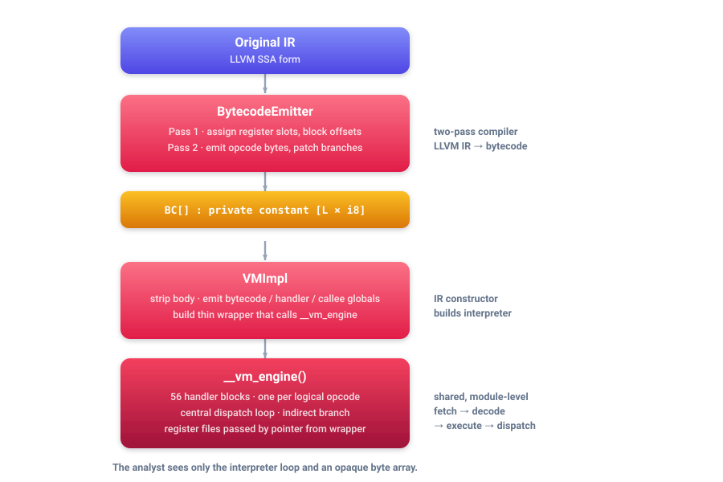
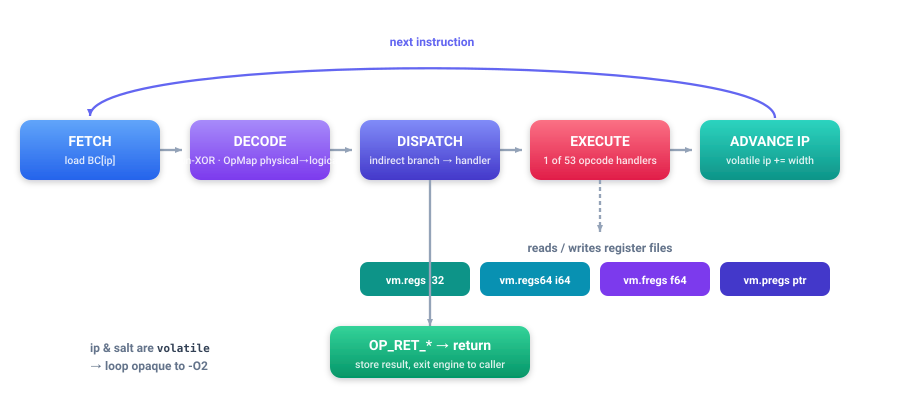
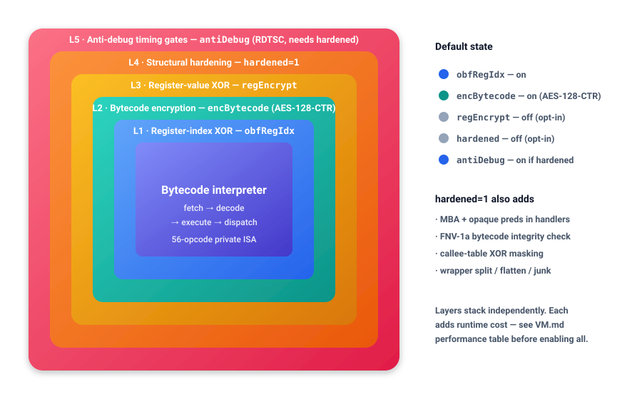

# VM Pass — Code Virtualisation Reference

The `vm` pass is the most powerful transformation in the obfuscator. It compiles an entire
function body into a **private bytecode stream** stored in a read-only global, then replaces
the function body with a minimal **fetch–decode–execute interpreter**. No original basic
blocks, instruction patterns, or CFG structure survive in the emitted IR.

This document covers the internal architecture, ISA specification, hardening layers,
configuration reference, interaction with other passes, debugging, and known limitations.

---

## Table of contents

- [Conceptual overview](#conceptual-overview)
- [Architecture](#architecture)
  - [Module-level shared engine](#module-level-shared-engine)
  - [Per-function wrapper and globals](#per-function-wrapper-and-globals)
  - [Register files](#register-files)
  - [Interpreter state](#interpreter-state)
- [Compilation pipeline](#compilation-pipeline)
  - [Eligibility check](#eligibility-check)
  - [PHI demotion](#phi-demotion)
  - [Slot assignment — Pass 1](#slot-assignment--pass-1)
  - [Bytecode emission — Pass 2](#bytecode-emission--pass-2)
  - [IR construction phases](#ir-construction-phases)
- [ISA reference](#isa-reference)
  - [Integer / pointer opcodes](#integer--pointer-opcodes)
  - [64-bit integer opcodes](#64-bit-integer-opcodes)
  - [Floating-point opcodes](#floating-point-opcodes)
  - [Control flow opcodes](#control-flow-opcodes)
  - [Call opcodes](#call-opcodes)
  - [Sub-opcode tables](#sub-opcode-tables)
  - [Instruction encoding summary](#instruction-encoding-summary)
- [Opcode permutation](#opcode-permutation)
- [Hardening layers](#hardening-layers)
  - [Layer 1 — Register-index XOR (obfRegIdx)](#layer-1--register-index-xor-obfregidx)
  - [Layer 2 — AES-128-CTR bytecode encryption (encBytecode)](#layer-2--aes-128-ctr-bytecode-encryption-encbytecode)
  - [Layer 3 — Register-value XOR (regEncrypt)](#layer-3--register-value-xor-regencrypt)
  - [Layer 4 — Structural hardening (hardened=1)](#layer-4--structural-hardening-hardened1)
  - [Layer 5 — Anti-debug timing gates (antiDebug)](#layer-5--anti-debug-timing-gates-antidebug)
- [Structural virtualisation features](#structural-virtualisation-features)
  - [Nested virtualisation (nestedVM)](#nested-virtualisation-nestedvm)
  - [Threaded dispatch (threadedDispatch)](#threaded-dispatch-threadeddispatch)
  - [IP-keyed dispatch (keyedDispatch)](#ip-keyed-dispatch-keyeddispatch)
  - [Super-operators (superOps)](#super-operators-superops)
  - [Per-build ISA randomisation (randISA)](#per-build-isa-randomisation-randisa)
  - [Engine pool and metamorphic engines](#engine-pool-and-metamorphic-engines)
- [Configuration reference](#configuration-reference)
  - [Presets](#presets)
- [Interaction with other passes](#interaction-with-other-passes)
- [Eligibility and skip reasons](#eligibility-and-skip-reasons)
- [Performance considerations](#performance-considerations)
- [Debugging virtualised functions](#debugging-virtualised-functions)
  - [Using the obfuscation report](#using-the-obfuscation-report)
  - [Inspecting emitted IR](#inspecting-emitted-ir)
  - [Common failure modes](#common-failure-modes)
- [Extending the ISA](#extending-the-isa)

---

## Conceptual overview

<p align="center">
  
</p>

Inside `__vm_engine`, control never leaves a single **fetch → decode → execute → dispatch**
loop until an `OP_RET_*` opcode returns the result to the caller:

<p align="center">
  
</p>

The result: a reverse engineer sees only the interpreter loop and an opaque byte array.
Recovering the original logic requires understanding the ISA, the opcode permutation map,
the layer-2 decryption key, and (when hardened) the anti-debug and register-encryption layers.

At the CFG level the effect is total: the original control-flow graph disappears entirely,
replaced by a single thin wrapper block that hands off to the shared `__vm_engine` bytecode
interpreter (rendered from the obfuscator's own CFG report):

<p align="center">
  
</p>

---

## Architecture

### Module-level shared engine

All 53 opcode handlers live in a **shared engine function** `__vm_engine()`.
By default a single engine is created once per module and populated on first use, so the
handler code is **not duplicated** for each virtualised function — only the thin wrapper and
per-function globals are unique per function.

> **Engine pool and per-function engines.** A build can instead spread functions across
> *several* structurally-distinct engines (`enginePoolSize=N`), give a function its own
> private engine (`perFnEngine=1`), or diversify every engine's handler bodies
> (`metamorphicEngines=1`). Nested virtualisation (`nestedVM=1`) adds a second engine layer.
> See [Engine pool and metamorphic engines](#engine-pool-and-metamorphic-engines) and
> [Nested virtualisation](#nested-virtualisation-nestedvm). The single-engine layout
> described here is the `enginePoolSize=1` default.

`__vm_engine` signature (18 parameters, or 19 with the trailing `lazyctx` under `lazyDecrypt`;
all by value or pointer):

| Param # | Name | Type | Purpose |
|---|---|---|---|
| 0 | `bc` | `ptr` | Pointer to `@fn.vm.bytecode` (may be the encrypted runtime copy) |
| 1 | `bc_len` | `i32` | Length of the bytecode in bytes |
| 2 | `regs` | `ptr` | Caller-allocated `[N × i32]` integer register file |
| 3 | `regs64` | `ptr` | Caller-allocated `[N × i64]` 64-bit register file |
| 4 | `fregs` | `ptr` | Caller-allocated `[N × double]` float register file |
| 5 | `pregs` | `ptr` | Caller-allocated `[N × ptr]` pointer register file |
| 6 | `callees` | `ptr` | Per-function callee address table |
| 7 | `salt` | `i32` | Full 32-bit compile-time salt (stored volatile) |
| 8 | `regMask` | `i32` | `nextPow2(NVR) - 1` — register index masking |
| 9 | `reg64Mask` | `i32` | `nextPow2(NVR64) - 1` |
| 10 | `fregMask` | `i32` | `nextPow2(NFR) - 1` |
| 11 | `pregMask` | `i32` | `nextPow2(NPR) - 1` |
| 12 | `handlers` | `ptr` | Per-function permuted handler-address table |
| 13 | `fty_indices` | `ptr` | Per-function callee `FunctionType` index table |
| 14 | `regkeys` | `ptr` | Per-slot i32 XOR key array (null = off) |
| 15 | `reg64keys` | `ptr` | Per-slot i64 XOR key array (null = off) |
| 16 | `fregkeys` | `ptr` | Per-slot f64-as-i64 XOR key array (null = off) |
| 17 | `callee_mask` | `i64` | Per-slot callee XOR masks (packed) |

### Per-function wrapper and globals

Three globals are emitted per virtualised function (with mangled names derived from the function name):

| Global | LLVM Type | Linkage | Contents |
|---|---|---|---|
| `@<fn>.vm.bytecode` | `[L × i8]` | `private constant` | Encrypted bytecode stream (L bytes) |
| `@<fn>.vm.ophandlers` | `[OP_COUNT × ptr]` | `private constant` | Permuted handler-address table |
| `@<fn>.vm.callees` | `[C × ptr]` | `private constant` | Callee function-pointer table |

The function body is stripped. The new body:
1. Allocates the four register files on the stack (`alloca`).
2. Initialises all register slots with zero / null.
3. Pre-loads constant values into their assigned slots (constant materialisation).
4. Loads function arguments into their assigned register slots.
5. Tail-calls `__vm_engine` with all per-function parameters.

### Register files

The VM maintains four separate typed register files:

| File | LLVM alloca type | Purpose | Max slots |
|---|---|---|---|
| `vm.regs` | `[N × i32]` | 32-bit integer values | 255 |
| `vm.regs64` | `[N × i64]` | 64-bit integer values | 255 |
| `vm.fregs` | `[N × double]` | Floating-point values (all stored as f64) | 255 |
| `vm.pregs` | `[N × ptr]` | Pointer values | 255 |

Slot 0 in each file is the zero/null sentinel. f32 values are widened to f64 on slot
assignment and narrowed back when stored to memory or returned.

### Interpreter state

Interpreter state is held in allocas within `vm.entry` (the thin wrapper):

| Alloca name | Type | Purpose |
|---|---|---|
| `vm.ip` | `i32` (volatile) | Bytecode instruction pointer |
| `vm.salt` | `i32` (volatile) | Compile-time salt (opaque to optimizer due to volatile) |
| `vm.regs` | `[N × i32]` | Integer register file |
| `vm.regs64` | `[N × i64]` | 64-bit register file |
| `vm.fregs` | `[N × double]` | Float register file |
| `vm.pregs` | `[M × ptr]` | Pointer register file |

The `volatile` annotation on `vm.ip` and `vm.salt` is intentional: it prevents the optimizer
from simplifying the fetch–decode–execute loop even when the obfuscated IR is passed through
a subsequent `-O2` pipeline.

---

## Compilation pipeline

### Eligibility check

`isVMEligible()` rejects the function if any of the following hold:

| Condition | Skip reason |
|---|---|
| Contains EH pads or `invoke` | `EH/invoke` |
| Contains `callbr` | `callbr` |
| Contains `indirectbr` | `indirectbr already` |
| Has `naked` attribute | `naked` |
| Block count < `minBlocks` | `too few blocks(N<M)` |
| Block count > `maxBlocks` (when `maxBlocks > 0`) | `too many blocks(N>M)` |

If the function is skipped, the skip reason is recorded in the obfuscation report JSON.

### PHI demotion

The bytecode ISA has no PHI concept. Before bytecode emission, all PHI nodes are demoted to
`alloca` / `load` / `store` triples inserted in a dedicated entry block. Each demoted PHI
gets a `preg` slot pointing to the alloca.

### Slot assignment — Pass 1

`BytecodeEmitter::run()` performs a first walk in Reverse Post-Order (RPO) to:

1. Assign register slots in declaration order: function arguments → entry-block allocas
   (from PHI demotion) → all remaining SSA instruction results.
2. Record the byte offset (`BlockIP`) of each basic block's first instruction.
3. Build constant materialisation lists (`ImmLoads`, `ImmLoads64`, `ImmLoadsF`, `PtrLoads`).

Slot assignment is deterministic for a given IR because RPO is stable under the same seed.

### Bytecode emission — Pass 2

A second RPO walk emits the actual opcode bytes into `BC[]`. Key points:

- Each register-index byte is XOR'd with `SaltConst & 0xFF` when `obfRegIdx=1`.
- Forward branch targets are emitted as zero-filled placeholders (`fixup_u32`).
- After the full walk, all fixups are patched with the resolved `BlockIP` values.
- When `OpMap` is non-null (opcode permutation enabled), every opcode byte is encoded via
  `OpMap->encode(logical_op)` before writing.

### IR construction phases

After bytecode emission, `VMImpl::run()` calls these builders in order:

1. `buildBytecodeGlobal()` — create `@fn.vm.bytecode` constant (unencrypted at this point).
2. `buildCalleeGlobal()` — create `@fn.vm.callees` constant.
3. Under `nestedVM`: create the `__vm_h_*` helper functions (plain bodies) so handler cases can
   emit calls to them.
4. Select this function's engine (`EngineId`, derived from its pool index and the nested/plain
   layer) and ensure it exists (`getOrBuildVMEngine`).
5. If that engine is not yet populated: `populateVMEngine()` → `buildOpcodeHandlers()` (six
   groups) → `diversifyHandlerVariants()` → `metamorphRewriteEngine()` (per-clone body rewrite
   under `metamorphicEngines`) → `buildDispatch()` → (hardened) `hardenVMEngine()`.
6. Under `nestedVM`: `virtualizeNestedHelpersOnce()` — inner-virtualise the shared helpers once
   per module, against the plain pool-0 engine.
7. `buildHandlerTable()` — emit the per-function permuted `@fn.vm.ophandlers` constant.
8. `buildVMEntry()` — replace the original function body with the wrapper.
9. Encryption constructor: `buildEncryptCtor()` (AES-128-CTR; under `lazyDecrypt` the whole-buffer
   decrypt is elided in favour of per-fetch keystream blocks).
10. Under `bindAntiDebug`: `buildAntiDebugKeyBindCtor()` — priority-100 ctor that folds
    debugger detection into the AES round-key mask.
11. If `hardened=1`: `hardenWrapper()` (split + junk + opaque predicates), `mbaHardenWrapper()`
    (MBA on wrapper arithmetic), `flattenWrapper()` (switch-dispatch flattening),
    `buildAntiDebugGate()` (RDTSC timing traps), `buildIntegrityHashCtor()` (FNV-1a bytecode
    integrity check), and `buildCalleeXorCtor()` (callee XOR masking in `.init_array`).

---

## ISA reference

The ISA has **53 logical opcodes** (`OP_COUNT = 0x35`), variable-width encoding,
and little-endian multi-byte immediates. (The two most recent additions are
`OP_LOADI64` = 0x33, used by `constInStream`, and `OP_MULADD` = 0x34, used by `superOps`.)

Physical opcode bytes in the bytecode stream are **not** the logical VMOp values — they are
passed through a per-function permutation (see [Opcode permutation](#opcode-permutation)).

<details open>
<summary><b>🔢 Integer / pointer opcodes</b></summary>

| Logical opcode | Value | Encoding (bytes) | Description |
|---|---|---|---|
| `OP_LOADI` | 0x00 | `opc dst:u8 imm:i32le` (6 B) | Load 32-bit immediate into vreg. |
| `OP_MOVR` | 0x01 | `opc dst:u8 src:u8` (3 B) | Copy vreg to vreg. |
| `OP_BINOP` | 0x02 | `opc dst:u8 a:u8 b:u8 subop:u8` (5 B) | Binary integer op on vregs. See BinSubop table. |
| `OP_ICMP` | 0x03 | `opc dst:u8 a:u8 b:u8 pred:u8` (5 B) | Integer compare; result (0/1) into vreg. |
| `OP_CAST` | 0x04 | `opc dst:u8 src:u8 kind:u8` (4 B) | Integer widening/narrowing within the i32 file. See CastKind table. |
| `OP_PTRTOINT` | 0x05 | `opc dst:u8 srcp:u8` (3 B) | `ptrtoint` preg → vreg (i32). |
| `OP_INTTOPTR` | 0x06 | `opc dstp:u8 src:u8` (3 B) | `inttoptr` vreg → preg. |
| `OP_LOAD32` | 0x07 | `opc dst:u8 ptrreg:u8` (3 B) | Load i32 from address in preg. |
| `OP_STORE32` | 0x08 | `opc val:u8 ptrreg:u8` (3 B) | Store i32 to address in preg. |
| `OP_GEP` | 0x09 | `opc dstp:u8 basep:u8 idx:u8 elemsz:u16le` (6 B) | GEP: `basep + idx * elemsz` → preg. |
| `OP_LOAD8` | 0x1B | `opc dst:u8 ptrreg:u8` (3 B) | Load i8 (zero-extend to i32). |
| `OP_STORE8` | 0x1C | `opc val:u8 ptrreg:u8` (3 B) | Truncate vreg to i8, store. |
| `OP_LOAD16` | 0x1D | `opc dst:u8 ptrreg:u8` (3 B) | Load i16 (zero-extend to i32). |
| `OP_STORE16` | 0x1E | `opc val:u8 ptrreg:u8` (3 B) | Truncate vreg to i16, store. |
| `OP_LOADPTR` | 0x1F | `opc dstp:u8 ptrreg:u8` (3 B) | Load pointer from address in preg. |
| `OP_STOREPTR` | 0x20 | `opc valp:u8 ptrreg:u8` (3 B) | Store pointer to address in preg. |
| `OP_SELECT` | 0x12 | `opc kind:u8 dst:u8 cond:u8 t:u8 f:u8` (6 B) | Ternary select across register files. |
| `OP_PTRTOINT64` | 0x13 | `opc dst64:u8 srcp:u8` (3 B) | `ptrtoint` preg → vreg64 (i64). |
| `OP_MULADD` | 0x34 | `opc dst:u8 a:u8 b:u8 c:u8` (5 B) | Fused `dst = a*b + c` (i32). Emitted by `superOps` in place of a `mul`+`add` pair. |

</details>

<details>
<summary><b>🔟 64-bit integer opcodes</b></summary>

| Logical opcode | Value | Encoding | Description |
|---|---|---|---|
| `OP_LOAD64` | 0x14 | `opc dst64:u8 ptrreg:u8` (3 B) | Load i64 from address in preg. |
| `OP_STORE64` | 0x15 | `opc val64:u8 ptrreg:u8` (3 B) | Store i64 to address in preg. |
| `OP_CAST64` | 0x16 | `opc dst:u8 src:u8 kind:u8` (4 B) | Cross-file cast between i32 and i64. See Cast64Kind table. |
| `OP_BINOP64` | 0x17 | `opc dst64:u8 a64:u8 b64:u8 subop:u8` (5 B) | Binary op on vreg64 file. Same BinSubop encoding. |
| `OP_ICMP64` | 0x1A | `opc dst:u8 a64:u8 b64:u8 pred:u8` (5 B) | 64-bit integer compare; result → vreg (i32). |
| `OP_GEP64` | 0x19 | `opc dstp:u8 basep:u8 idx64:u8 elemsz:u16le` (6 B) | GEP with 64-bit index. |
| `OP_LOADI64` | 0x33 | `opc dst64:u8 imm:i64le` (10 B) | Load 64-bit immediate into vreg64. Emitted by `constInStream` to carry i64 constants inside the encrypted bytecode prologue instead of a plaintext wrapper store. |

</details>

<details>
<summary><b>🔣 Floating-point opcodes</b></summary>

All floats are stored as `double` in the freg file. f32 source values are widened on slot
assignment; f32 destinations are narrowed on store or return.

| Logical opcode | Value | Encoding | Description |
|---|---|---|---|
| `OP_LOADI_F` | 0x21 | `opc dst:u8 imm:f64le` (10 B) | Load f64 immediate into freg. |
| `OP_MOVR_F` | 0x22 | `opc dst:u8 src:u8` (3 B) | Copy freg to freg. |
| `OP_BINOP_F` | 0x23 | `opc dst:u8 a:u8 b:u8 subop:u8` (5 B) | Binary float op. See FBinSubop table. |
| `OP_FCMP` | 0x24 | `opc dst:u8 a:u8 b:u8 pred:u8` (5 B) | Float compare (LLVM predicate byte); result → vreg (i32). |
| `OP_FCAST_FF` | 0x25 | `opc dst_fr:u8 src_fr:u8 kind:u8` (4 B) | fpext / fptrunc within freg file. |
| `OP_LOAD_F` | 0x26 | `opc dst:u8 ptrreg:u8` (3 B) | Load f64 (8-byte double) from memory into freg. |
| `OP_STORE_F` | 0x27 | `opc val:u8 ptrreg:u8` (3 B) | Store f64 from freg to memory. |
| `OP_LOAD_F32` | 0x2D | `opc dst:u8 ptrreg:u8` (3 B) | Load 4-byte float, fpext → freg. |
| `OP_STORE_F32` | 0x2E | `opc val:u8 ptrreg:u8` (3 B) | fptrunc freg → store 4-byte float. |
| `OP_RET_F` | 0x28 | `opc src:u8` (2 B) | Return f64 from freg. |
| `OP_SELECT_F` | 0x29 | `opc dst:u8 cond:u8 t:u8 f:u8` (5 B) | Ternary select on freg. |
| `OP_FNEG` | 0x2C | `opc dst_fr:u8 src_fr:u8` (3 B) | Negate freg value. |
| `OP_FCAST_FV` | 0x2F | `opc dst:u8 src:u8 kind:u8` (4 B) | freg (f64) → vreg (i32): fptosi / fptoui. |
| `OP_FCAST_FV64` | 0x30 | `opc dst64:u8 src:u8 kind:u8` (4 B) | freg (f64) → vreg64 (i64): fptosi / fptoui. |
| `OP_FCAST_VF` | 0x31 | `opc dst:u8 src:u8 kind:u8` (4 B) | vreg (i32) → freg (f64): sitofp / uitofp. |
| `OP_FCAST_V64F` | 0x32 | `opc dst:u8 src64:u8 kind:u8` (4 B) | vreg64 (i64) → freg (f64): sitofp / uitofp. |

</details>

<details>
<summary><b>🔀 Control flow opcodes</b></summary>

| Logical opcode | Value | Encoding | Description |
|---|---|---|---|
| `OP_JMP` | 0x0A | `opc target:u32le` (5 B) | Unconditional branch to bytecode offset. |
| `OP_JMPC` | 0x0B | `opc cond:u8 tgt_t:u32le tgt_f:u32le` (10 B) | Conditional branch; `cond` is a vreg. |
| `OP_SWITCH` | 0x18 | `opc cond:u8 ncases:u16le def:u32le [case:u32le tgt:u32le]*` (variable) | Multi-way branch. |
| `OP_RET_VOID` | 0x0C | `opc` (1 B) | Return void. |
| `OP_RET_INT` | 0x0D | `opc src:u8` (2 B) | Return i32 from vreg. |
| `OP_RET_PTR` | 0x0E | `opc srcp:u8` (2 B) | Return ptr from preg. |

</details>

<details>
<summary><b>📞 Call opcodes</b></summary>

All call opcodes share the same extended encoding (Step 02 format):

```
opc  [dst_reg:u8]  fn:u8  nargs:u8  flags:u8  argtypes:u16le  [arg:u8 × nargs]
```

- `fn` — index into the per-function callee table.
- `nargs` — number of arguments (max 8).
- `flags` — `CF_VARARG (0x01)` if the callee is variadic; otherwise `CF_NONE (0x00)`.
- `argtypes` — 2 bits per argument (packed little-endian): `CAT_VREG=0`, `CAT_PREG=1`,
  `CAT_VREG64=2`, `CAT_FREG=3`.
- Each `arg:u8` — register slot index in the corresponding register file.

| Logical opcode | Value | Return |
|---|---|---|
| `OP_CALL_VOID` | 0x0F | void |
| `OP_CALL_INT` | 0x10 | i32 → vreg `dst` |
| `OP_CALL_PTR` | 0x11 | ptr → preg `dstp` |
| `OP_CALL_INT64` | 0x2A | i64 → vreg64 `dst64` |
| `OP_CALL_F` | 0x2B | f64 → freg `dstf` |

</details>

<details>
<summary><b>🧮 Sub-opcode tables</b> (BinSubop, FBinSubop, CastKind, …)</summary>

**BinSubop** (for `OP_BINOP` and `OP_BINOP64`):

| Value | Operation | LLVM instruction |
|---|---|---|
| 0 | `BS_ADD` | `add` |
| 1 | `BS_SUB` | `sub` |
| 2 | `BS_MUL` | `mul` |
| 3 | `BS_AND` | `and` |
| 4 | `BS_OR` | `or` |
| 5 | `BS_XOR` | `xor` |
| 6 | `BS_SHL` | `shl` |
| 7 | `BS_LSHR` | `lshr` |
| 8 | `BS_ASHR` | `ashr` |
| 9 | `BS_SDIV` | `sdiv` |
| 10 | `BS_UDIV` | `udiv` |
| 11 | `BS_SREM` | `srem` |
| 12 | `BS_UREM` | `urem` |

**FBinSubop** (for `OP_BINOP_F`):

The subop byte carries two fields. Bits `[6:0]` are the operation; bit `[7]` is `FBS_F32_FLAG`
(set when the LLVM source instruction operates on `float` rather than `double` — the result
is rounded back to f32 precision via fptrunc→fpext before being stored).

| Value | Operation |
|---|---|
| 0 | `FBS_FADD` — `fadd [fast]` |
| 1 | `FBS_FSUB` — `fsub [fast]` |
| 2 | `FBS_FMUL` — `fmul [fast]` |
| 3 | `FBS_FDIV` — `fdiv [fast]` |
| 4 | `FBS_FREM` — `frem` (fmod, no fast-math) |

**CastKind** (for `OP_CAST` — within the i32 register file):

| Value | Operation |
|---|---|
| 0 | `CK_ZEXT1` — zero-extend i1 → i32 |
| 1 | `CK_ZEXT8` — zero-extend i8 → i32 |
| 2 | `CK_ZEXT16` — zero-extend i16 → i32 |
| 3 | `CK_SEXT8` — sign-extend i8 → i32 |
| 4 | `CK_SEXT16` — sign-extend i16 → i32 |
| 5 | `CK_TRUNC1` — truncate i32 → i1 |
| 6 | `CK_TRUNC8` — truncate i32 → i8 |
| 7 | `CK_TRUNC16` — truncate i32 → i16 |

**Cast64Kind** (for `OP_CAST64` — cross-file between i32 and i64):

| Value | Operation |
|---|---|
| 0–3 | `C64_ZEXT1/8/16/32` — zero-extend vreg (1/8/16/32-bit) → vreg64 |
| 4–6 | `C64_SEXT8/16/32` — sign-extend vreg (8/16/32-bit) → vreg64 |
| 7–10 | `C64_TRUNC1/8/16/32` — truncate vreg64 → vreg (1/8/16/32-bit) |

**FCastKind** (for `OP_FCAST_FF/FV/FV64/VF/V64F`):

| Value | Operation | Src → Dst |
|---|---|---|
| 0 | `FK_FPEXT` | freg (f32 semantics) → freg (f64) |
| 1 | `FK_FPTRUNC` | freg (f64) → freg (f32 semantics) |
| 2 | `FK_FPTOSI` | freg (f64) → vreg (i32) |
| 3 | `FK_FPTOUI` | freg (f64) → vreg (i32) |
| 4 | `FK_SITOFP` | vreg (i32) → freg (f64) |
| 5 | `FK_UITOFP` | vreg (i32) → freg (f64) |
| 6 | `FK_FPTOSI64` | freg (f64) → vreg64 (i64) |
| 7 | `FK_FPTOUI64` | freg (f64) → vreg64 (i64) |
| 8 | `FK_SI64TOFP` | vreg64 (i64) → freg (f64) |
| 9 | `FK_UI64TOFP` | vreg64 (i64) → freg (f64) |

</details>

<details>
<summary><b>📐 Instruction encoding summary</b></summary>

| Opcode | Bytes | Layout |
|---|---|---|
| `OP_LOADI` | 6 | `opc dst imm0 imm1 imm2 imm3` |
| `OP_LOADI64` | 10 | `opc dst64 imm0 imm1 imm2 imm3 imm4 imm5 imm6 imm7` |
| `OP_LOADI_F` | 10 | `opc dst f0 f1 f2 f3 f4 f5 f6 f7` |
| `OP_MOVR` | 3 | `opc dst src` |
| `OP_BINOP` | 5 | `opc dst a b subop` |
| `OP_MULADD` | 5 | `opc dst a b c` |
| `OP_ICMP` | 5 | `opc dst a b pred` |
| `OP_CAST` | 4 | `opc dst src kind` |
| `OP_PTRTOINT` | 3 | `opc dst srcp` |
| `OP_INTTOPTR` | 3 | `opc dstp src` |
| `OP_LOAD32/8/16` | 3 | `opc dst ptrreg` |
| `OP_STORE32/8/16` | 3 | `opc val ptrreg` |
| `OP_LOADPTR` | 3 | `opc dstp ptrreg` |
| `OP_STOREPTR` | 3 | `opc valp ptrreg` |
| `OP_GEP` | 6 | `opc dstp basep idx esz0 esz1` |
| `OP_JMP` | 5 | `opc t0 t1 t2 t3` |
| `OP_JMPC` | 10 | `opc cond tt0..tt3 tf0..tf3` |
| `OP_SWITCH` | 3+6×N | `opc cond nc0 nc1 def0..def3 [case0..case3 tgt0..tgt3]×N` |
| `OP_RET_VOID` | 1 | `opc` |
| `OP_RET_INT` | 2 | `opc src` |
| `OP_RET_PTR` | 2 | `opc srcp` |
| `OP_CALL_VOID` | 3+N | `opc fn nargs flags at0 at1 [arg]×N` |
| `OP_CALL_INT/PTR/INT64/F` | 4+N | `opc dst fn nargs flags at0 at1 [arg]×N` |

</details>

---

## Opcode permutation

Each virtualised function gets a **unique logical↔physical opcode bijection** stored in
`@<fn>.vm.ophandlers`. The bijection is a Fisher-Yates shuffle over all 53 opcodes, seeded
from the per-function RNG:

```cpp
template <typename TRand>
void VMOpcodeMap::initPermuted(TRand& R) {
    // Shuffle physical array; build L2P and P2L maps.
}
```

The physical handler table `@<fn>.vm.ophandlers` is indexed by *physical* byte value, so
each function has a completely different dispatch table — defeating cross-function opcode
signature matching by pattern search.

The emitter calls `OpMap->encode(logical_op)` before writing each opcode byte into `BC[]`.
The interpreter calls `OpMap->decode(physical_byte)` at dispatch to recover the logical opcode
and branch to the correct handler in `__vm_engine`.

---

## Hardening layers

Five independent layers stack on top of the base bytecode interpreter. Each is controlled by
its own knob and adds runtime cost independently:

<p align="center">
  
</p>

### Layer 1 — Register-index XOR (`obfRegIdx`)

**Default: on.**

Every register-index byte in the bytecode stream is XOR'd with `SaltConst & 0xFF`
at compile time. At runtime each opcode handler re-XORs the loaded byte with the same
volatile salt load before indexing into the register file:

```
real_slot = bytecode_slot ^ (vm.salt & 0xFF)
```

The volatile load of `vm.salt` prevents the optimizer from constant-folding this away.
A static analyst sees a register access with an index that depends on a volatile, opaque value.

To disable: `obfRegIdx=0`.

### Layer 2 — AES-128-CTR bytecode encryption (`encBytecode`)

**Default: on.** AES-128-CTR is the only bytecode cipher (the legacy LCG keystream path was
removed — the `useAES` knob is now a no-op accepted for backward compatibility).

A per-function 128-bit AES key is generated from the RNG hierarchy at compile time. A
`.init_array` constructor calls `__obf_aes_ctr_decrypt(key, nonce, bytecode, len)` — the same
runtime stub shared with the `strenc` pass — to decrypt `@<fn>.vm.bytecode` in place before
`main()`. The dispatch loop additionally re-derives each fetched opcode byte from the volatile
salt and IP (see [IP-keyed dispatch](#ip-keyed-dispatch-keyeddispatch)).

**Lazy decryption (`lazyDecrypt=1`, requires `encBytecode`).** Instead of the ctor decrypting
the whole buffer up front, the runtime bytecode stays ciphertext at rest and each fetched byte
is decrypted on demand from a recomputed AES-CTR keystream block (`__obf_aes_ctr_keystream_block`).
The engine gains a trailing `lazyctx` parameter (round key + nonce + keystream cache) that the
wrapper allocates and unmasks per call, so a memory dump never sees the decrypted bytecode as a
contiguous plaintext region. The per-byte keystream recompute is branchless (no CFG split), which
is required because the fetch helpers must stay straight-line.

**Constants in the stream (`constInStream=1`, requires `encBytecode`).** By default integer and
floating-point constants are materialised by plaintext `store` instructions in the wrapper. With
`constInStream` they are spliced into the encrypted bytecode as an `OP_LOADI` / `OP_LOADI64` /
`OP_LOADI_F` prologue instead, so the constants live inside the AES-encrypted stream rather than
in cleartext IR. Pointer constants stay in the wrapper (they carry relocations and are not
secret).

### Layer 3 — Register-value XOR (`regEncrypt`)

**Default: off** (opt-in due to runtime overhead).

A per-slot XOR key table is generated for each register file. Every register read (load)
decrypts the value; every register write (store) encrypts it:

```
stored = actual_value ^ key_table[slot]
actual = stored ^ key_table[slot]
```

This defeats memory-dump attacks that read register file contents at runtime. The key tables
are stored as module-level constants and passed to `__vm_engine` via the `regkeys`,
`reg64keys`, and `fregkeys` parameters.

### Layer 4 — Structural hardening (`hardened=1`)

When `hardened=1`, the compiler applies a secondary round of structural obfuscation to the
interpreter wrapper and (when building the shared engine for the first time) to `__vm_engine`
itself:

- **Wrapper hardening** (`hardenWrapper`): splits the wrapper into multiple blocks, inserts
  junk instructions, and adds opaque predicates around the tail call setup.
- **MBA hardening** (`mbaHardenWrapper`): applies Mixed Boolean/Arithmetic transformations
  to arithmetic in the wrapper.
- **Wrapper flattening** (`flattenWrapper`): further flattens the wrapper with a
  switch-dispatch pattern.
- **Engine hardening** (`hardenVMEngine`): applies MBA and opaque predicates inside the
  shared `__vm_engine` handler blocks.
- **Bytecode integrity** (`buildIntegrityHashCtor`): a `.init_array` constructor computes
  an FNV-1a hash of the (decrypted) bytecode and compares it against a compile-time value.
  On mismatch the salt is corrupted, causing silent incorrect execution.
- **Callee XOR masking** (`buildCalleeXorCtor`): a `.init_array` constructor XOR-masks
  entries in the callee table; the dispatch handler un-masks before calling.

### Layer 5 — Anti-debug timing gates (`antiDebug`)

Active when both `hardened=1` and `antiDebug=1`.

- **Dispatch-level gate** (`buildAntiDebugGate`): every `adDispatchInterval` fetch iterations
  (default 64), the interpreter checks whether the RDTSC delta since the last check exceeds
  `adDispatchThreshold` cycles (default 5000). If exceeded (suggesting a debugger step or
  hardware breakpoint), `emitSaltCorruption` is called — the salt is XOR'd with a
  `PoisonKey`, causing all subsequent register-index deobfuscation to produce wrong slots
  and silently corrupt execution.
- **Handler spot-checks**: `adHandlerProb`% of handlers (default 10%) get an inline RDTSC
  check against `adHandlerThreshold` (default 5000 cycles). To avoid false positives from
  ordinary scheduling noise, a trap poisons the salt only after **`kDebounce` consecutive**
  slow executions (a latch prevents the self-inverse XOR from cancelling), so a lone timing
  spike no longer corrupts a correct run.

The salt-corruption approach produces silently wrong results rather than a crash or an
exception, which makes debugging under a debugger harder to detect and diagnose.

**Anti-debug bound into the key schedule (`bindAntiDebug=1`, requires `hardened`).** Instead
of (or in addition to) the timing traps, a per-function `.init_array` constructor at priority
100 — running *before* the AES-decrypt ctor — reads `IsDebuggerPresent`,
`CheckRemoteDebuggerPresent`, and `NtQueryInformationProcess(ProcessDebugPort)` and XORs a
`bit × ADPoisonKey` mask into the first 16 bytes of the masked AES round-key global. Under a
debugger the AES key that decrypts the bytecode is wrong, so the bytecode decodes to garbage
and the program crashes before the interpreter runs a single opcode; under a normal run the
mask is untouched. When `bindAntiDebug` is on, the handler-level RDTSC traps are skipped
entirely (they were the historical source of timing flakes).

---

## Structural virtualisation features

These features change the *shape* of the interpreter itself — its dispatch, its ISA encoding,
and how many engines exist — rather than layering encryption on top of a fixed interpreter.
Each is behind its own knob (all default off unless noted) and each is byte-identical to the
previous build when its knob is off. They compose with one another and with the hardening
layers above.

### Nested virtualisation (`nestedVM`)

The compute step of several eligible opcodes (BINOP, BINOP64, ICMP, ICMP64, FCMP, CAST,
BINOP_F) is outlined into a pure helper function `__vm_h_<op>` that is **itself virtualised**.
Executing one such outer opcode therefore drives a whole inner interpreter loop — depth-2
virtualisation on hot arithmetic.

Recursion is made impossible by using two *distinct* engines rather than a runtime flag on one:
the outer function targets `__vm_engine.nest` (whose eligible handlers *call* the helper), while
every helper is virtualised against the plain `__vm_engine` (whose handlers compute inline). A
helper's own arithmetic thus runs through the plain engine, which never calls back into a
helper. The shared `__vm_h_*` helper set is virtualised exactly once per module.

- `nestedVMOpcodes` — `0` nests all eligible opcodes; `N>0` nests only the first `N` in the
  fixed order above.
- `nestedVMHardened` — reserved (hardening the tiny helper wrapper currently yields a
  dominance-invalid rewrite; left off).

### Threaded dispatch (`threadedDispatch`)

Removes the single central `vm.dispatch` / `vm.fetch` pair. Every handler instead ends with its
own inlined fetch + decode + `indirectbr` tail, so the classic "one `urem`, one GEP, one
`indirectbr`" central-loop fingerprint disappears. The nested-VM inner engine inherits threaded
dispatch from the outer config, so both engines are threaded consistently.

### IP-keyed dispatch (`keyedDispatch`)

Each opcode byte is XOR'd at emit time with a per-IP compile-time key `K(salt, IP) =
((salt·(IP+1)) ⊕ (salt≫8)) & 0xFF`, and un-XOR'd at fetch time (in both the central and threaded
paths, and in the verifier). The *same* physical byte at two different IPs therefore decodes to
different logical opcodes, so a static byte→handler map no longer holds. This is a compile-time
key, not cryptography: it defeats static byte-signature matching, not a symbolic-execution
lifter. (When composed with `constInStream`, body opcode bytes are re-keyed after the prologue
splice shifts their IPs.)

### Super-operators (`superOps`)

Recognises `%m = mul i32 %a,%b; %d = add i32 %m,%c` chains (where the `mul` is consumed only by
the `add`) and fuses them into a single `OP_MULADD` opcode computing `a*b + c`. Lifting the
handler no longer recovers a bare `mul` or `add` primitive. Emission is anchored at the `add`'s
position so SSA dominance guarantees all inputs are available.

### Per-build ISA randomisation (`randISA`)

Complements the per-function [opcode permutation](#opcode-permutation): where that permutes the
*opcode* byte per function, `randISA` permutes the *operand-field encodings* per **build**,
module-uniformly. Two builds of the same source at different seeds then share no static handler
signature for the permuted families, because the shared-engine switch/select-chain constants —
and the emitted operand bytes — differ. Five families are permuted: **BinSubop** (integer
`OP_BINOP`/`OP_BINOP64`), **ICmp predicates**, **CastKind**, **FBinSubop** (float arithmetic,
preserving the f32 flag bit), and **FCmp predicates**. Each family draws from its own
seed-derived RNG, so the maps are independent. The permutation is derived from the module seed
(not the per-function RNG), so the shared handler, every per-function emitter, and the nested
helpers all agree.

### Engine pool and metamorphic engines

By default one shared engine serves the whole module — lift it once and every virtualised
function is understood. These knobs raise that per-lift *multiplier*:

- **`enginePoolSize=N`** — build `N` structurally-distinct engines per module and assign each
  function to one deterministically (by a hash of its name and the module seed). Engines are
  named `__vm_engine`, `__vm_engine.p1`, `__vm_engine.p2`, … (and, under `nestedVM`,
  `__vm_engine.nest`, `__vm_engine.nest.p1`, …). Lifting one function's engine gives no shortcut
  for a function that runs a different one. Cost scales roughly linearly (~30 KB `.text` per
  engine).
- **`metamorphicEngines=1`** (requires a pool, or `perFnEngine`) — rewrites each engine's integer
  handler arithmetic with semantics-preserving MBA identities chosen from a *per-engine* seed, so
  the pool engines have structurally **distinct handler bodies**, not just distinct names — even
  when `handlerVariants=1` and `hardened=0` would otherwise leave the bodies identical.
- **`perFnEngine=1`** — give *this* function its own private engine (a wide per-function hash id)
  instead of hashing it into the pool. Because annotations are per-function, setting it on
  selected critical functions gives them dedicated engines while the rest share the pool
  (annotation-selective); setting it everywhere yields a full per-function engine build. Highest
  structural resilience, highest `.text` cost.

`preset=max` turns on `perFnEngine` + `metamorphicEngines` (see below).

---

## Configuration reference

Annotation syntax:

```c
__attribute__((annotate("obf: vm(<params>)")))
```

A `preset=<light|medium|high|max>` bundle (below) is the easy way in; the individual knobs are:

| Parameter | Default | Range | Description |
|---|---|---|---|
| `preset` | — | light/medium/high/max | Canned knob bundle applied before explicit knobs (which override it). See [Presets](#presets). |
| `minBlocks` | 1 | 1–∞ | Skip if the function has fewer than N basic blocks. |
| `maxBlocks` | 400 | 0–∞ | Skip if the function has more than N blocks. 0 = no upper limit. |
| `obfRegIdx` | 1 | 0/1 | XOR register-index bytes with compile-time salt (layer 1). |
| `encBytecode` | 1 | 0/1 | AES-encrypt the bytecode via a load-time `.init_array` ctor (layer 2). |
| `lazyDecrypt` | 0 | 0/1 | Decrypt bytecode per-fetch instead of whole-buffer; keeps it ciphertext at rest. Requires `encBytecode`. |
| `constInStream` | 0 | 0/1 | Carry int/i64/fp constants inside the encrypted bytecode instead of plaintext wrapper stores. Requires `encBytecode`. |
| `regEncrypt` | 0 | 0/1 | Per-slot register-value XOR encryption (layer 3). |
| `rollingRegKey` | 0 | 0/1 | Evolve the register XOR key as the interpreter runs (with `regEncrypt`). |
| `hardened` | 0 | 0/1 | Layer-4 structural hardening + layer-5 anti-debug. |
| `handlerVariants` | 3 | 1–K | Number of structurally-distinct handler-body copies per opcode. |
| `encDispatch` | 1 | 0/1 | Route dispatch through an encrypted opcode-index map. |
| `strongBytecode` | 1 | 0/1 | Stronger bytecode obfuscation. |
| `blindTargets` | 1 | 0/1 | Blind branch/switch targets in the stream. |
| `threadedDispatch` | 0 | 0/1 | Inline fetch/decode/`indirectbr` into every handler; no central dispatch. |
| `keyedDispatch` | 0 | 0/1 | XOR each opcode byte with a per-IP compile-time key. |
| `superOps` | 0 | 0/1 | Fuse `mul`+`add` chains into `OP_MULADD`. |
| `randISA` | 0 | 0/1 | Per-build permutation of operand-field byte encodings (5 families). |
| `nestedVM` | 0 | 0/1 | Virtualise eligible opcode handlers against a second engine. |
| `nestedVMOpcodes` | 0 | 0–7 | Cap on how many opcodes nest (0 = all eligible). |
| `enginePoolSize` | 1 | 1–∞ | Build N distinct engines and spread functions across them. |
| `metamorphicEngines` | 0 | 0/1 | Per-clone MBA rewrite so pool engines have distinct bodies. Requires a pool or `perFnEngine`. |
| `perFnEngine` | 0 | 0/1 | Give this function its own dedicated engine. |
| `antiDebug` | 1 | 0/1 | RDTSC anti-debug timing gates (requires `hardened=1`). |
| `bindAntiDebug` | 0 | 0/1 | Fold anti-debug detection into the AES key mask (requires `hardened`+`antiDebug`). |
| `adDispatchThreshold` | 5000 | — | RDTSC cycle delta for dispatch-level gate. |
| `adHandlerThreshold` | 5000 | — | RDTSC cycle delta for per-handler spot checks (debounced). |
| `adDispatchInterval` | 64 | — | Check every N fetch iterations. Must be a power of 2. |
| `adHandlerProb` | 10 | 0–100 | Percentage of handlers equipped with timing traps. |

> The legacy `useAES` knob was removed — AES-128-CTR is now the only bytecode cipher.
> `useAES=…` in an annotation is silently ignored.

### Presets

`preset=<name>` resolves to a knob bundle *before* explicit knobs are parsed, so any explicit
knob still overrides the preset:

| Preset | Bundle |
|---|---|
| `light` | Structural virtualisation only — `obfRegIdx`, `encBytecode`, `handlerVariants=1`. |
| `medium` | Today's defaults — `handlerVariants=3`, `encDispatch`, `strongBytecode`, `blindTargets`. Bit-identical to a bare `vm(...)`. |
| `high` | `medium` + `hardened` + `threadedDispatch` + `keyedDispatch`. |
| `max` | `high` + `lazyDecrypt` + `constInStream` + `nestedVM` + `superOps` + `rollingRegKey` + `bindAntiDebug` + `randISA` + `perFnEngine` + `metamorphicEngines`. |

**Usage examples:**

```c
// Minimum: virtualise with default layers (AES + register-index XOR)
__attribute__((annotate("obf: vm")))
int fn(int x) { return x; }

// Strongest single-annotation tier: full stack, per-function metamorphic engines
__attribute__((annotate("obf: vm(preset=max)")))
int fn2(int key, int data) { return key ^ data; }

// Full hardening with per-slot register encryption and anti-debug
__attribute__((annotate("obf: vm(hardened=1, regEncrypt=1, antiDebug=1)")))
int fn3(int key, int data) { return key ^ data; }

// Structural diversity without hardening: 4-engine pool + metamorphic bodies + per-build ISA
__attribute__((annotate("obf: vm(enginePoolSize=4, metamorphicEngines=1, randISA=1)")))
int fn4(int x) { return x * 3 + 1; }

// Tune anti-debug thresholds for a slower target (embedded, VM, etc.)
__attribute__((annotate("obf: vm(hardened=1, antiDebug=1, adDispatchThreshold=50000, adHandlerThreshold=20000)")))
int fn5(int x) { return x * 3; }

// Skip small functions, cap at 200 blocks
__attribute__((annotate("obf: vm(minBlocks=5, maxBlocks=200)")))
int fn6(int a, int b, int c) { return a + b + c; }
```

---

## Interaction with other passes

### vm conflicts with flattening

Both `vm` and `flattening` restructure the entire function CFG. Using them together on the
same function is **not supported** and will be rejected by the pipeline driver at compile time.

### Combining vm with pre-passes

`vm` benefits from being applied **after** other passes because the pre-passes transform the
LLVM IR that the VM pass then compiles to bytecode. The resulting bytecode encodes already-
obfuscated logic, which a reverse engineer must first understand at the bytecode level
before they can apply any further analysis:

```c
// Recommended: pre-obfuscate with mba + bcf, then virtualise
__attribute__((annotate("obf: mba(prob=70,maxDepth=3), bcf(prob=30,loop=1), vm(hardened=1)")))
int fn(int x, int y) { return x * y + (x ^ y); }
```

The pipeline ordering rules enforce this automatically: `vm` runs after `mba`, `substitution`,
`vcall`, `split`, `sdiff`, and `bcf` whenever all are enabled on the same function.

### vm and shield/adec

`vm` runs before `shield` and `adec` in the ordering rules, meaning post-hardening passes
see the wrapper IR (not the original function body). This is intentional:
- `shield` adds volatile barriers to the wrapper, hardening the tail-call setup against optimization.
- `adec` adds indirectbr trampolines and junk to the wrapper.

For maximum protection apply `hardened=1` on `vm` itself AND use `shield`/`adec` on the same
function to harden the wrapper layer.

### vm and strenc

`strenc` is a module-level pass that runs before the function driver. String encryption
and VM virtualisation are orthogonal — they share the AES runtime stub
(`__obf_aes_ctr_decrypt`) but do not interfere with each other.

---

## Eligibility and skip reasons

The `vm` pass records a skip reason in the report JSON whenever it cannot process a function.
Common skip reasons:

| Skip reason | Cause | Fix |
|---|---|---|
| `EH/invoke` | Function contains EH pads or `invoke` | Remove EH from the function, or do not annotate it with `vm`. |
| `callbr` | Function contains `callbr` (asm-goto) | Remove inline `asm goto`, or do not annotate. |
| `indirectbr already` | Function already uses `indirectbr` | Remove existing `indirectbr`, or do not annotate. |
| `naked` | Function has `naked` attribute | `naked` functions have no stack frame and cannot host register files. |
| `too few blocks(N<M)` | Block count < `minBlocks` | Lower `minBlocks` or add more code to the function. |
| `too many blocks(N>M)` | Block count > `maxBlocks` | Raise `maxBlocks` or split the function. |
| `unsupported instruction: …` | BytecodeEmitter encountered an unsupported LLVM instruction | See the emitter unsupported-instruction list; file a bug or split the function. |
| `cap_max_function_insts` | Global `-obf-max-function-insts` cap hit | Raise the global cap or do not annotate large functions. |
| `budget_exhausted` | IR budget consumed by preceding passes | Raise `-obf-ir-budget-multiplier` or reduce intensity of pre-passes. |

---

## Performance considerations

The `vm` pass has significant runtime overhead compared to native execution. The interpreter
loop processes one opcode at a time; each opcode involves multiple loads, a volatile IP
increment, and an indirect branch for dispatch.

**Rough runtime cost estimates** (varies greatly by target, function complexity, and
hardening level):

| Configuration | Overhead range |
|---|---|
| Base (no hardening) | 5–20× slowdown vs. native |
| `obfRegIdx=1` (default) | +5–15% over base |
| `encBytecode=1` (whole-buffer AES) | Negligible runtime cost (`.init_array` overhead) |
| `lazyDecrypt=1` (per-fetch AES) | +30–100% over base (one keystream block per operand byte) |
| `nestedVM=1` | +2–10× over base (depth-2 interpretation of hot arithmetic) |
| `enginePoolSize=N` / `perFnEngine` | Negligible runtime cost; ~30 KB `.text` per engine |
| `metamorphicEngines=1` | Negligible runtime cost; larger engine `.text` (MBA-expanded handlers) |
| `regEncrypt=1` | +20–50% over base (register access pattern) |
| `hardened=1` | +15–30% over base (extra instructions in handlers) |
| `antiDebug=1` | +1–5% over base (RDTSC checks, amortised) |

**Mitigation strategies:**

- Apply `vm` only to the **most sensitive** functions — key derivation, license checks,
  protocol parsing, etc.
- Prefer `mba` + `flattening` for functions where moderate obfuscation is acceptable and
  performance matters.
- Use `minBlocks` to prevent trivially simple functions from being virtualised (they provide
  little benefit and pay the full interpreter overhead).
- Combine with `--o2-gate` in the test suite to verify that the wrapper survives a subsequent
  `-O2` pass without semantic changes.

---

## Debugging virtualised functions

### Using the obfuscation report

Run with a fixed seed and report generation:

```bash
opt -passes=obfuscation -S test.ll -o test.obf.ll \
  -obf-seed=1 -obf-deterministic -obf-verify \
  -obf-report-dir=obf_report

python utils/obf_report_html.py \
  --json obf_report/obf_report.json \
  --out  obf_report/obf_report.html \
  --renderer dot
```

In the HTML report:
- Navigate to the function and look at the `passes[]` array.
- The `vm` pass entry shows `status`, `changed`, `insts_before`, `insts_after`, and `delta_insts`.
- A large `delta_insts` is expected — the interpreter IR is substantially larger than the original.
- If `status = "skipped"`, the `skip_reason` field explains why.
- The CFG diff for `vm` will show the entire original CFG replaced by the wrapper + engine structure.

### Inspecting emitted IR

After obfuscation, the interesting globals in the IR are:

```bash
# Find the bytecode global for a function named 'secret'
grep 'secret.vm.bytecode' test.obf.ll

# Inspect the vm_engine function
grep -A 200 'define.*__vm_engine' test.obf.ll | head -100
```

Use `-obf-verbose` to see eligibility decisions, slot counts, and bytecode sizes:

```bash
opt -passes=obfuscation -S test.ll -o /dev/null \
  -obf-seed=1 -obf-verbose 2>&1 | grep '\[vm\]'
```

### Common failure modes

**Assertion `vr(): untracked value` or `pr(): untracked value`:**
An SSA value was encountered during bytecode emission that was not assigned a register slot
in Pass 1. This typically means a `select`, PHI, or constant expression slipped through
without being demoted. File a bug with the LLVM IR that triggers it.

**`unsupported instruction: X`:**
The BytecodeEmitter encountered an LLVM instruction it cannot translate. Common unsupported
instructions include: `extractelement`, `insertelement`, `shufflevector`, `landingpad`,
`catchpad`, `fneg` on non-double types. The function will be skipped.

**Miscompile after O2:**
If the obfuscated function produces wrong results after a subsequent `-O2` pass:
- Check whether the `hardened` wrapper relies on `volatile` correctly (it should).
- Run `--o2-gate` in the test suite for the specific pass combination.
- Check whether a newer LLVM release introduced an optimization that sees through one of the
  opaque patterns — file a hardening enhancement request.

**Anti-debug false positives (wrong results on real hardware, correct under debugger removed):**
- Lower `adDispatchThreshold` and `adHandlerThreshold` for slow targets (embedded, virtualised).
- Disable anti-debug with `antiDebug=0` for testing, then re-enable for release.
- Remember that VMs, emulators, and heavily loaded systems can trigger RDTSC thresholds without a debugger.

---

## Extending the ISA

To add a new opcode:

1. Add the new `VMOp` enumerator to `VMPass_ISA.h` **before** `OP_COUNT`. Bump `OP_COUNT`.
2. Add the new `BinSubop` / `CastKind` / etc. sub-opcode if needed. If it is an operand-field
   encoding you want `randISA` to permute, add a family to `ISAEnc` (`VMPass_ISA.h`) and encode
   it at both the emitter and the handler switch/select-chain.
3. Add the emission case in `BytecodeEmitter::emit(Instruction*)` in `VMPass_Emitter.cpp`.
4. Add the handler `BasicBlock` in the appropriate `buildHandlers*` group in
   `VMPass_Handlers.cpp` (the pass implementation was split by concern:
   `VMPass_Handlers.cpp`, `VMPass_Wrapper.cpp`, `VMPass_Dispatch.cpp`, `VMPass_Nested.cpp`,
   `VMPass_Crypto.cpp`, `VMPass_AntiDebug.cpp`, `VMPass_Harden.cpp`; declarations stay in
   `VMPass_Impl.h`).
5. Update `VMPass_Verifier.h/cpp` — including the **opcode size table** — to handle the new
   opcode. A missing size entry makes the verifier report truncation on valid bytecode.
6. If the opcode should participate in nested virtualisation, add a `__vm_h_<op>` helper and its
   entry in `kNestedHelperOrder` (`VMPass_Impl.h`) + factory in `VMPass_Nested.cpp`.
7. Add a runtime test case in `utils/cases/vm.py` (+ gate in `utils/gates/vm.py`) that exercises
   the new instruction type.
8. Update this document and the ISA tables above.

> [!NOTE]
> The Fisher-Yates shuffle in `VMOpcodeMap::initPermuted` naturally covers the new opcode
> because it iterates over all `OP_COUNT` values. No changes are needed to the permutation
> logic — only the static table size (`OP_COUNT`) matters.
